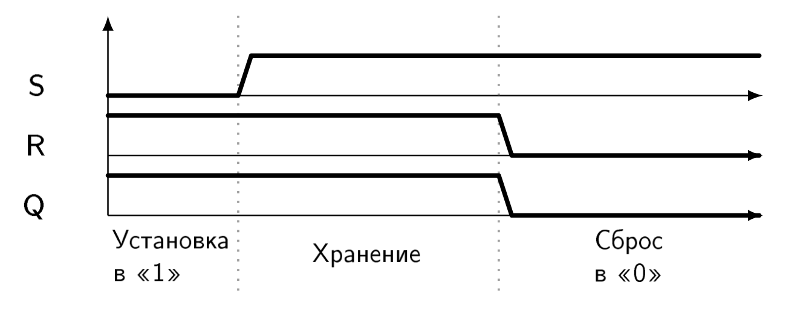
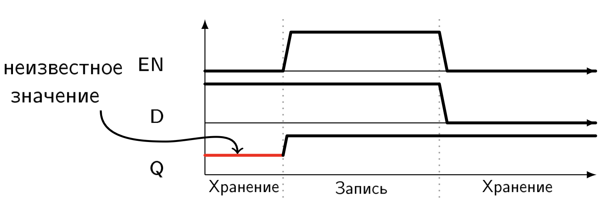
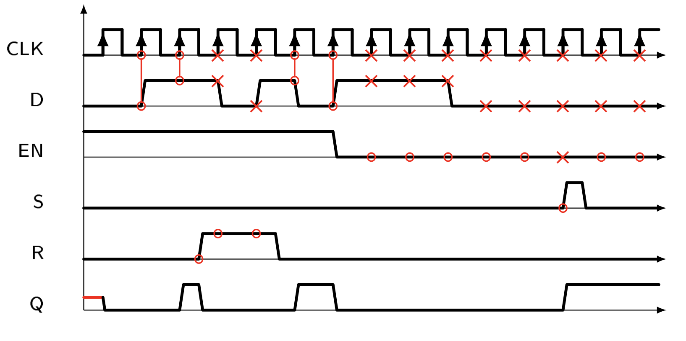
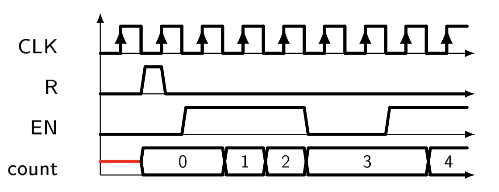
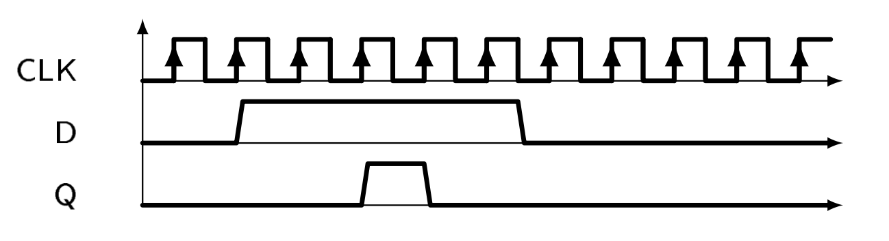

# Лабораторная работа 2. Регистры и счётчики

Функции цифровых устройств, естественно, не сводятся к реализации разнообразных ФАЛ. Нам хотелось бы использовать цифровые устройства для обработки информации, вычислений. Но для осуществления этих возможностей нам недостаёт элемента памяти, который мог бы хранить промежуточные результаты. Ведь невозможно сделать калькулятор, если нет возможности сохранить вводимые числа и результат вычисления.

Элемент памяти — один из самых важных элементов цифровых устройств. Чтобы не делать ошибок при разработке цифровых устройств, необходимо понять место этого узла, его идею и инструменты языка SystemVerilog, связанные с ним.

Первый элемент памяти, который мы рассмотрим — это  **защелка** (англ. latch).

Защелка является основой всех элементов памяти. Она состоит из двух элементов И-НЕ (или из двух элементов ИЛИ-НЕ, в зависимости от базиса, выбранного при проектировании), соединенных по следующей схеме:


У защелки два входа и два выхода. Входами являются сигналы "сброс" и "установка в единицу" или по-английски "reset" и "set". В зависимости от элементов, из которых состоит защелка, полярность входных сигналов будет меняться. В базисе И-НЕ сброс и установка происходят, когда соответственно сигналы R или S находятся в нуле, поэтому их обозначают как "не-сброс" и "не-установка", чтобы отразить этот факт. Выход защелки — это тот бит данных, который она хранит. Два выхода отличаются полярностью — один из них инвертирует хранимый бит. Ниже приведена таблица со всеми возможными комбинациями входных сигналов и временная диаграмма работы защелки.



Опишем защелку на языке SystemVerilog, опираясь на её структуру, которую мы рассмотрели выше. Нам понадобятся два входа, два выхода и два элемента И-НЕ, которые мы опишем с помощью операций И (оператор `&`) и НЕ (оператор `~`).

Описание RS-защелки на языке SystemVerilog
```systemverilog
module latch_struct(
  input  logic nR,
  input  logic nS,
  output logic Q,
  output logic nQ
);

assign Q = ~(nS & nQ);
assign nQ = ~(nR & Q);

endmodule
```

Элемент памяти нам, прежде всего, нужен для хранения данных. Для того, чтобы защелкой стало удобнее пользоваться, немного изменим схему подключения управляющих сигналов.


Защелка теперь будет работать следующим образом: при высоком уровне на входе "разрешить работу" (enable) данные со входа "данные" (data) будут проходить через защелку на выход, при низком уровне на входе "разрешить работу" защелка будет сохранять на выходе последнее значение со входа "данные", которое было до переключения сигнала "разрешить работу". Работа такой защелки показана на временной диаграмме ниже.



Как мы уже говорили, использовать структурные описания не всегда удобно. В большинстве случаев использовать поведенческое описание намного эффективнее. Поведенческое описание часто формулируется гораздо лаконичнее, и, так как его легче понять человеку, улучшается читаемость кода и уменьшается вероятность ошибок при его написании.

Поведенческое описание D-защелки на языке SystemVerilog
```systemverilog
module d_latch_behav(
  input  logic d,
  input  logic en,
  output logic q
);

always_latch begin
  if (en)
    q <= d;
end

endmodule
```

Если добавить к этой схеме еще две защелки, то можно привязать изменение "содержимого" защелки к переходу управляющего сигнала из `0` в `1`. Тогда получим следующую структуру:


Эту схему можно немного доработать, введя управляющие сигналы сброса, установки в единицу и разрешения работы. Упрощенно такая схема изображается следующим образом.


Эта схема получила широчайшее применение в цифровой схемотехнике и называется D-триггер (от слова "data" — данные). Ниже приведена временная диаграмма работы D-триггера.



Заметим, что сигнал `C` называют **тактирующим** сигналом или "сигналом синхронизации". Обычно в роли этого сигнала выступает сигнал от внешнего источника (чаще всего кварцевого резонатора) со стабильной частотой. А сами цифровые устройства, для работы которых необходим сигнал синхронизации, называют синхронными.

Сигнал синхронизации играет очень большую роль в цифровых устройствах. Прежде всего, он необходим для того, чтобы избежать непредсказуемого и нестабильного поведения триггеров в цифровых устройствах.

Описание D-триггера на языке SystemVerilog
```systemverilog
module d_flipflop_behav(
  input  logic clk,
  input  logic rst,
  input  logic d,
  input  logic en,
  output logic q
);

always_ff @(posedge clk or posedge rst) begin
  if (rst)
    q <= 0;
  else if (en)
    q <= d;
end

endmodule

```


В описании появилось новое ключевое слово `posedge`. Оно используется только в списке чувствительности блока `always_ff` и означает событие перехода сигнала, имя которого стоит после этого ключевого слова, из состояния `0` в состояние `1`.

Ключевое слово `posedge` было введено прежде всего для того, чтобы описывать схемы, содержащие триггеры. Ведь триггеры, как мы уже говорили, могут менять своё состояние только в момент положительного фронта (англ. positive edge) сигнала синхронизации.

Добавление в список чувствительности события `posedge rst` позволяет описать поведение триггера в момент асинхронного сброса: как только случается переход rst из `0` в `1` срабатывает блок `always_ff` и проверка условия `if (rst)` дает положительный результат, триггер сбрасывается в `0`.

Если объединить несколько триггеров в группу, то получится то, что в цифровой схемотехнике называют **регистр**.

Описание регистра на языке SystemVerilog
```systemverilog
module register_behav(
  input  logic       clk,
  input  logic       rst,
  input  logic [7:0] d,
  input  logic       en,
  output logic [7:0] q
);

always_ff @(posedge clk or posedge rst) begin
  if (rst)
    q <= 0;
  else if (en)
    q <= d;
end

endmodule

```

Элементы памяти позволяют нам сохранять информацию для дальнейшей обработки или хранить готовый результат вычисления, хранить промежуточные результаты.

Запомните описание регистра. Оно используется при проектировании практически любого цифрового устройства с помощью SystemVerilog.

Необходимо отметить важную концепцию языка SystemVerilog. **Один сигнал может быть изменен (записан) только в пределах одного блока always. Сигналы доступны для проверки в любом из блоков, но изменять их значение можно только в одном из них.**


Пример ошибочного присвоения значения переменной в разных блоках `always_ff` на языке SystemVerilog
```systemverilog
logic a;
logic b;

always_ff @(posedge clk) begin
  if (in < 5)
    a <= in;
end

always_ff @(posedge clk) begin
  if (n > 5) begin
    b <= in;
    a <= in - 5; // Error!
  end
  else
    b <= a;
end

```

Одной из простейших, и в тоже время широко распространённой, цифровой схемой на основе регистров является счётчик.

Счётчик считает количество тактов, которое прошло с момента его обнуления.

Такая простая схема, тем не менее, используется практически в каждом цифровом устройстве. Как будет показано дальше, счётчик легко можно доработать таким образом, чтобы отсчитывались не такты, а какие-то события. Например, событиями могут быть: нажатие кнопки, принятие пакета данных, срабатывание датчика, выполнение какого-то условия (периодическое) и другое.


Итак, для того чтобы реализовать счетчик нам понадобится регистр и сумматор. Причем сумматор будет складывать значение, хранящееся в регистре, с константой (в нашем случае единицей), а результат сложения будет поступать на вход регистра.


В результате получим следующую схему:


На временной диаграмме ниже хорошо видно как работает счётчик:



Опишем поведение такого счётчика на SystemVerilog.

Описание восьмибитного счетчика на языке SystemVerilog
```systemverilog
module counter_8bit(
  input  logic       clk,
  input  logic       rst,
  input  logic       en,
  output logic [7:0] counter
);

always_ff @(posedge clk or posedge rst) begin
  if (rst)
    counter <= 0;
  else if (en)
    counter <= counter + 1;
end

endmodule

```

Для того чтобы можно было подсчитывать события, а не переходы сигнала синхронизации из `0` в `1` понадобится ввести еще одну схему. Её смысл и назначение заключается в следующем: нам необходимо из асинхронного события получить синхронный сигнал единичной длительности. Тогда, подавая такой сигнал на вход enable счётчика, мы сможем считать количество произошедших событий.
[] # Написать тут про кнопки и причем они тут вообще

Ниже представлена схема, позволяющая сделать это:




Описание схемы синхронизации на языке SystemVerilog

```systemverilog
module button_sync(
  input  logic clk,
  input  logic in,
  output logic out
);

  logic [2:0] button_syncroniser;
  logic       button_was_pressed;

  always_ff @(posedge clk) begin
    button_syncroniser[0] <= in;
    button_syncroniser[1] <= button_syncroniser[0];
    button_syncroniser[2] <= button_syncroniser[1];
  end

  assign button_was_pressed = ~button_syncroniser[2]
                            &  button_syncroniser[1];

  assign out = button_was_pressed;

endmodule

```


Естественно такая схема работает только тогда, когда входной сигнал изменяется с частотой меньшей, чем частота синхронизации.

Сигнал `OUT` в таком случае подключается к входу `EN` счётчика.

## Задание лабораторной работы

Описать на языке SystemVerilog цифровое устройство, функционирующее согласно следующим принципам:

1. Ввод информации происходит с переключателей `SW[9:0]` и кнопок `BTNL`, `BTNR`. Внешний источник сигнала синхронизации: `CLK_100`;
2. `BTNR` должна функционировать как общий асинхронный сброс устройства;
3. При нажатии на `BTNL` записывать данные с `SW[9:0]` в десятибитный регистр;
4. Содержимое десятибитного регистра выводить на `LEDR[9:0]`;
5. При нажатии на `BTNL` увеличивать 8-ми разрядный счётчик нажатий на 1, если произошло событие, указанное в индивидуальном задании студента;
6. Содержимое счётчика выводить в шестнадцатеричной форме на HEX0 (цифры с 0 до 9 и буквы A, B, C, D, E, F)

Выполнив описание модуля на языке SystemVerilog, необходимо построить временные диаграммы его работы с помощью САПР Vivado.

Привязать входы модуля к переключателям SW отладочной платы, а выход к шине `AN[7:0]` и сигналам CA, CB, CC, CD, CE, CF, CG, DP, получить прошивку для ПЛИС и продемонстрировать её работу.

## Пример индивидуального задания

Событием является наличие 3 и более единиц на `SW[9:0]` в момент записи в регистр.

Решение индивидуального задания (фрагмент кода лабораторной работы)

```systemverilog
logic sw_event;
always_comb begin
  if ((SW[0] + SW[1] + SW[2] + SW[3]
     + SW[4] + SW[5] + SW[6] + SW[7]
     + SW[8] + SW[9]) > 4'd3) sw_event = 1'b1;
  else sw_event = 1'b0;
end

logic [2:0] event_sync_reg;
logic       synced_event;
assign synced_event =  event_sync_reg[1]
                    & ~event_sync_reg[0];

always_ff @(posedge CLK50) begin
  event_sync_reg[2]   <= sw_event;
  event_sync_reg[1:0] <= event_sync_reg[2:1];
end

```


## Варианты индивидуальных заданий

1.    Событие:
      Количество сочетаний «01» на переключателях `SW[9:0]` не менее 4.

2.    Событие:
      Количество переключателей `SW[9:0]` в положении «1» не менее 5.

3.    Событие:
      На переключателях закодировано число больше 10, но меньше 20.

4.    Событие:
      Четное количество переключателей `SW[9:0]` в положении «1». (нуль – четное число)

5.    Событие:
      Симметрия переключателей `SW[9:0]` относительно середины.

6.    Событие:
      Число на `SW[9:5]` больше числа на `SW[4:0]` как минимум в 2 раза.

7.    Событие:
      Асимметрия переключателей `SW[9:0]` относительно центра.

8.    Событие:
      Количество сочетаний «101» на переключателях не менее 2.

9.    Событие:
      Количество переключателей `SW[9:0]` в положении «1» не более 3.

10.   Событие:
      Нечетное количество переключателей `SW[9:0]` в положении «1».


## Вопросы к защите лабораторной работы

  1. Какие элементы памяти вы изучили в данной лабораторной работе?
  2. Чем отличается RS-защелка от D-защелки?
  3. Какие входы могут быть у триггера? Перечислите все и назовите их функции.
  4. Какие блоки вашего цифрового устройства синхронные? Какие нет? Почему?
  5. Какой фрагмент вашего кода описывает вывод значения счетчика на семисегментный индикатор? Как называется эта цифровая схема?
  6. Продемонстрируйте код, реализующий индивидуальное задание.
  7. Покажите в коде лабораторной работы код, реализующий счётчик.
  8. Что такое сигнал синхронизации?
