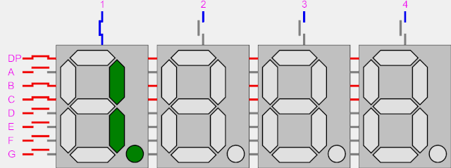

# Лабораторная работа 4. Динамическая индикация 7-сегментных экранов

До текущего момента мы использовали для вывода информации только единственный разряд семисегментных индикаторов, расположенных на отладочном стенде с FPGA.

Для того, чтобы научиться использовать все разряды, необходимо понять, как вообще подключены индикаторы на печатной плате.

Рассмотрим работу индикатора с 4 разрядами на примере анимации:



- Можно увидеть, что катоды всех индикаторов (выводы DP, A, B, C, D, E, F, G) соединены параллельно.
- В то же время, аноды всех индикаторов (выводы 1, 2, 3, 4) подключены независимо.

Для того, чтобы зажечь один индикатор (например, индикатор 3) и вывести на него что-нибудь, необходимо подать сигналы на катоды и коммутировать анод номер 3.

Главная проблема такого подключения - невозможность одновременного отображения различных данных сразу на нескольких индикаторах. Но, как уже понятно из анимации, эту проблему легко обойти, если достаточно быстро переключать индикаторы и выводить на каждый из них свои данные. Человеческий глаз не в состоянии заметить мигание и мерцание светодиодных индикаторов, если оно происходит с достаточно высокой частотой.

Давайте опишем на SystemVerilog логику такой схемы.


Начнём с шапки модуля:

```systemverilog
module hex_driver(
  input logic        clk_i,
  input logic        rst_i,
  input logic [31:0] data_i,
  input logic [7:0]  dots_i,

  output logic [7:0] an,
  output logic       ca,
  output logic       cb,
  output logic       cc,
  output logic       cd,
  output logic       ce,
  output logic       cf,
  output logic       cg,
  output logic       dp
);
```

- Сигнал `data_i` принимает входные данные для отображения на индикаторах, 8 индикаторов по 4 бита (значения от `0` до `F`) дают в сумме ширину шины в 32 бита.
- Сигнал `dots_i` отвечает за управление точками на семисегментых индикаторах.
- Выходной сигнал `an` отвечает за коммутацию анодов индикаторов, по 1 биту на каждый индикатор. Активный уровень этого сигнала - `0`.
- Выходные сигналы `ca`, `cb`, `cc`, `cd`, `ce`, `cf`, `cg`, `dp` отвечают за коммутацию катодов. Активный уровень этого сигнала - `0`.


Светодиоды, а также управляющие ими транзисторы имеют некоторую ненулевую инертность, включаются и выключаются не мгновенно. Если пытаться переключать семисегментные индикаторы со слишком высокой частотой, они не будут светиться с достаточно высокой яркостью. По этой причине нам необходимо немного уменьшить частоту мигания, и мы можем сделать это с помощью счётчика, считающего от `0` до `7`.

```systemverilog
  logic [2:0] clk_div_ff;

  always_ff @(posedge clk_i or posedge rst_i) begin
    if (rst_i)
      clk_div_ff <= 3d'0;
    else
      clk_div_ff <= clk_div_ff + 1;
  end
```

Следующим фрагментом логики является ещё один счётчик, в этот раз счётчик будет непосредственно управлять отображением информации на индикаторах. Значение этого счётчика определяет, какой из индикаторов будет гореть в данный момент времени.

```systemverilog
  logic [2:0] scan_cnt_ff;

  always_ff @(posedge clk_i or posedge rst_i) begin
    if (rst_i)
      scan_cnt_ff <= 3'd0;
    else if(clk_div_ff == 0)
      scan_cnt_ff <= scan_cnt_ff + 1;
  end
```
Обратите внимание на то, что данный счётчик переключается тогда, тогда `clk_div_ff == 0`, то есть один раз в 8 тактов. Таким образом, мы замедлили переключение индикаторов в 8 раз, относительно штатной частоты в 100 МГц.

Далее нам необходимо выбрать нужный фрагмент входных данных, в зависимости от значения `scan_cnt_ff`. Для этого мы используем мультиплексор:

```systemverilog
  logic [3:0] dc_hex_data;

  always_comb begin
    case (scan_cnt_ff)
      3'd0: dc_hex_data = data_i[3:0];
      3'd1: dc_hex_data = data_i[7:4];
      3'd2: dc_hex_data = data_i[11:8];
      3'd3: dc_hex_data = data_i[15:12];
      3'd4: dc_hex_data = data_i[19:16];
      3'd5: dc_hex_data = data_i[23:20];
      3'd6: dc_hex_data = data_i[27:24];
      3'd7: dc_hex_data = data_i[31:28];
    endcase
  end
```

Далее, необходимо конвертировать 4-битную шину `dc_hex_data` в шину для управления параллельно соединенными катодами. Для этого мы используем дешифратор, знакомый вам по ЛР1. Стоит ещё раз обратить внимание на то, что сегмент индикатора горит тогда, когда на соответствующем разряде `seg` значение `0`.

```systemverilog
//   ___A
// F|   |
//  |___|B
// E| G |
//  |___|C
//  D

  always_comb begin
    case(dc_hex_data) // GFEDCBA
      4'h0: seg = 7'b1000000; // ABCDEF
      4'h1: seg = 7'b1111001; // BC
      4'h2: seg = 7'b0100100; // ABDEG
      4'h3: seg = 7'b0110000; // ABCDG
      4'h4: seg = 7'b0011001; // BCFG
      4'h5: seg = 7'b0010010; // ACDFG
      4'h6: seg = 7'b0000010; // ACDEFG
      4'h7: seg = 7'b1111000; // ABC
      4'h8: seg = 7'b0000000; // ABCDEFG
      4'h9: seg = 7'b0010000; // ABCDFG
      4'ha: seg = 7'b0001000; // ABCEFG
      4'hb: seg = 7'b0000011; // CDEFG
      4'hc: seg = 7'b1000110; // ADEF
      4'hd: seg = 7'b0100001; // BCDEG
      4'he: seg = 7'b0000110; // ADEFG
      4'hf: seg = 7'b0001110; // AEFG
    endcase
  end

  assign ca = seg[0];
  assign cb = seg[1];
  assign cc = seg[2];
  assign cd = seg[3];
  assign ce = seg[4];
  assign cf = seg[5];
  assign cg = seg[6];
```

Давайте теперь подключим точки на индикаторах по тому же принципу, что и для обычных сегментов. Для точек нам не нужен дешифратор, поэтому мы можем управлять их катодами напрямую от `scan_cnt_ff`.

```systemverilog
  always_comb begin
    case (scan_cnt_ff)
      3'd0: dp = ~dots_i[0];
      3'd1: dp = ~dots_i[1];
      3'd2: dp = ~dots_i[2];
      3'd3: dp = ~dots_i[3];
      3'd4: dp = ~dots_i[4];
      3'd5: dp = ~dots_i[5];
      3'd6: dp = ~dots_i[6];
      3'd7: dp = ~dots_i[7];
    endcase
  end
```

Заключительной частью логики является дешифратор управления анодами

```systemverilog
  always_comb begin
    case (scan_cnt_ff)
      3'd0: an = 8'b11111110;
      3'd1: an = 8'b11111101;
      3'd2: an = 8'b11111011;
      3'd3: an = 8'b11110111;
      3'd4: an = 8'b11101111;
      3'd5: an = 8'b11011111;
      3'd6: an = 8'b10111111;
      3'd7: an = 8'b01111111;
    endcase
  end
```
По сути дела, нам нужно зажечь один из индикаторов в зависимости от значения `scan_cnt_ff`. Тут, опять же, работает принцип `0` - горит, `1` - не горит.

Полный код динамического контроллера семисегментных индикаторов можно найти в файле [hex_driver.sv](./rtl/hex_driver.sv)

## Задание лабораторной работы

### Часть 1
Используя драйвер для динамических HEX-индикаторов, реализовать отображение второго сегмента в лабораторной работе 2.

### Часть 2
- Вывести на семисегментые индикаторы слова согласно варианту
- Сделать переключение между двумя словами по SW[0]

0. ABSTRACT, JOYSTICK
1. APERTURE, LIGHTING
2. BEERFEST, LOOPBACK
3. BOUNDARY, NANOTECH
4. CASCADES, NERDCORE
5. CODEBASE, OBSOLETE
6. DATASETS, OPERATOR
7. DECODING, PAGEFILE
8. EDUCATOR, PATHETIC
9. ENDPOINT, QUADRANT
10. FAILSAFE, QUOTIENT
11. FATALITY, RAGNAROK
12. GALACTIC, RATIONAL
13. GREATEST, TYPECAST
14. HALFLIFE, TRANSFER
15. HELPFULL, UPSTREAM
16. ICECREAM, UNLOADER
17. ILLUSION, YOURSELF
18. JETLINER, YIELDING

Подсказки:
- Мы можете модифицировать логику дешифратора, отвечающего за вывод цифр на индикаторы
- Вы можете переключать входные данные в зависимости от SW[0] с помощью мультиплексора
- Используйте приведенные ниже варианты написания букв английского алфавита


