# Конечные автоматы

Когда мы проектировали секундомер, у нас возникла необходимость выделить признак того, что в данный момент секундомер работает. Для этого мы создали специальный регистр для хранения этого признака и описали схему управления этим регистром. В других блоках секундомера мы могли проверить признак работы (содержание регистра) и, в зависимости от него, разрешить, запретить или изменить работу.

Похожий подход применяется и в других случаях, когда необходимо выделить разные режимы работы цифрового устройства или обеспечить последовательное выполнение некоторых операций.

Действительно, ведь цифровое устройство существует целиком в один момент времени. Тогда как возможно добиться от него последовательного выполнения каких-то действий?

Вариант только один – описать ещё один блок, который будет управлять работой всей остальной части цифрового устройства.

Блок, который используется для этого, называется **конечный автомат**.

Существует целый раздел математики, посвященный автоматам (и в частности конечным автоматам), который, вполне ожидаемо, называется **теория автоматов**.

Но, так как нас, прежде всего, интересует прикладное применение конечных автоматов, мы рассмотрим их с точки зрения цифровой схемотехники.

**В цифровой схемотехнике, конечным автоматом называется цифровая схема, которая отслеживает текущее состояние и обеспечивает переход от одного состояния к другому в зависимости от входных воздействий.**

Например, в случае секундомера, который мы проектировали в прошлой лабораторной работе, конечный автомат, который мог бы управлять им, переключался бы между двумя состояниями: "остановлен" и "работает".

Для удобства проектирования конечный автомат представляют в виде графа. Вершины графа - это состояния, а рёбра графа - это воздействия, которые приводят к изменению состояния. Этот граф называют графом переходов конечного автомата.

Обычно граф переходов выглядит подобным образом:


Граф переходов – это основной источник информации о конечном автомате. Он дает наглядное представление о том, как управляется и работает конечный автомат.

Обратите внимание – конечный автомат всегда пребывает в одном из своих состояний. Конечный автомат не может пребывать в двух состояниях одновременно. Чем-то граф переходов может напомнить вам игровую доску, где фишка находится на одном из полей и, в зависимости от выполненных условий, может перейти в одно из полей, соединённых с текущим.

Классическим примером, наглядно демонстрирующим работу конечных автоматов, может служить конечный автомат управления светофором. Попробуем разработать такой автомат.

Можно легко выделить состояния светофора:
- "горит зеленый"
- "мигает зеленый"
- "горит желтый"
- "горит красный"
- "горит желтый и красный"
- "мигает желтый"

Обратите внимание: автомат управления не может находиться в двух состояниях одновременно и, поэтому, чтобы описать ситуацию когда горят одновременно желтый и красный сигналы, нам потребовалось ввести новое состояние - "горит желтый и красный".

Обозначим все вершины графа – состояния конечного автомата:


Теперь стрелками отметим на графе все возможные переходы из каждого состояния.

Например, из состояния "мигает зеленый" светофор может переключиться в состояние "горит желтый" или, если регулирование закончилось, в состояние "мигает желтый".

Над каждой стрелкой подпишем условие, которое должно выполниться, чтобы переход произошел. Т.е. над стрелкой от "мигает зеленый" к "горит желтый" напишем условие: "прошло 5 секунд", а над стрелкой от "мигает зеленый" к "мигает желтый" напишем условие "конец регулирования".

В итоге получим полный граф переходов конечного автомата:


Изучите его работу. Проследите, как можно попасть в то или иное состояние.

Обратите внимание, что одни и те же входные воздействия могут приводить к разным переходам, если они возникают в разных состояниях конечного автомата.

Итак, для того чтобы реализовать в цифровой схемотехнике такое устройство, нам понадобятся регистр для хранения состояния (назовём его **регистр состояния**).

Также понадобится схема, которая будет принимать решение о том, какое состояние будет следующим. Посмотрите на граф: входом такой схемы должно быть текущее состояние и входные воздействия. Имея эту информацию можно определить, какое состояние будет следующим.

Регистр состояния, очевидно, синхронная схема. То есть, переход между состояниями может произойти только по положительному фронту тактового сигнала. Но как определить сам момент, когда необходимо переключиться? Ведь он зависит от входных воздействий – переход должен состояться, когда будут выполнены необходимые условия.

В такой ситуации поступают следующим образом: **регистр состояний меняет текущее состояние на следующее каждый такт вне зависимости ни от каких условий**. При этом следующее состояние, пока условия не выполнены, равно текущему. Таким образом, значение регистра не меняется, пока не будут выполнены условия перехода.

Схема определения следующего состояния - асинхронная.

Входами этой схемы служат текущее состояние и все возможные входные сигналы (условия переходов). Выходом этой схемы будет следующее состояние.

Так как мы знаем все переходы, мы, фактически, определяем таблично заданную ФАЛ. Значит, эта схема является **дешифратором**.

Структура конечного автомата будет выглядеть следующим образом:


Так как в составе конечного автомата присутствует триггер, **конечный автомат является синхронным цифровым устройством**. Состояния конечного автомата меняются по положительному фронту сигнала синхронизации.

Используя такую структуру в качестве основы, опишем на языке SystemVerilog автомат, реализующий работу светофора.

```systemverilog
localparam YELLOW          = 3'b000;
localparam YELLOW_BLINKING = 3'b001;
localparam GREEN           = 3'b010;
localparam GREEN_BLINKING  = 3'b011;
localparam RED             = 3'b100;
localparam RED_AND_YELLOW  = 3'b101;

logic [2:0] state_ff;
logic [2:0] next_state;

always_comb begin
  if (end_work)
    next_state <= YELLOW_BLINKING;
  else begin
    case (state_ff)
      YELLOW_BLINKING: if (start_work)
        next_state <= GREEN;
      GREEN: if (passed_90_seconds)
        next_state <= GREEN_BLINKING;
      GREEN_BLINKING: if (passed_5_seconds)
        next_state <= YELLOW;
      YELLOW: if (passed_2_seconds)
        next_state <= RED;
      RED: if (passed_25_seconds)
        next_state <= RED_AND_YELLOW;
      RED_AND_YELLOW: if (passed_5_seconds)
        next_state <= GREEN;
      default:
        next_state <= YELLOW_BLINKING;
    endcase
  end
end

always_ff @(posedge clk or posedge rst) begin
  if (rst)
    state_ff <= YELLOW;
  else
    state_ff <= next_state;
end

```

Итак, мы реализовали конечный автомат. Но как им пользоваться? Как с помощью автомата управлять работой цифровой схемы?

Возможно, вы уже догадались, что для управления работой цифрового устройства используют анализ текущего состояния. Текущее состояние, в подавляющем большинстве случаев, и является выходом конечного автомата.

Анализируя состояние, можно переключать мультиплексоры, подавать (с помощью ФАЛ) необходимые входные воздействия или наборы данных, разрешать или запрещать работу блоков и модулей. Таким образом, можно существенно изменить поведение цифрового устройства.

Рассмотрим на конкретных примерах, как управлять работой светофора с помощью конечного автомата.

Управление светодиодами может осуществляться выходами компараторов.

Например, в состоянии "Горит зеленый", компаратор будет выдавать единицу, поступающую на зеленую лампочку.

Компаратор для управления светодиодами:


В состоянии \quotes"Мигает зеленый" все немного сложнее.

Существуют разные варианты решения этой задачи.

Один из возможных – следующий: разработать схему, вырабатывающую периодические импульсы, и подключить через вентиль **И** к сигналу управления зеленой лампой светофора. При этом сам сигнал управления подавать уже не в одном, а в двух состояниях автомата.

Схема управления миганием зелёного светодиода:


Схема работает следующим образом:

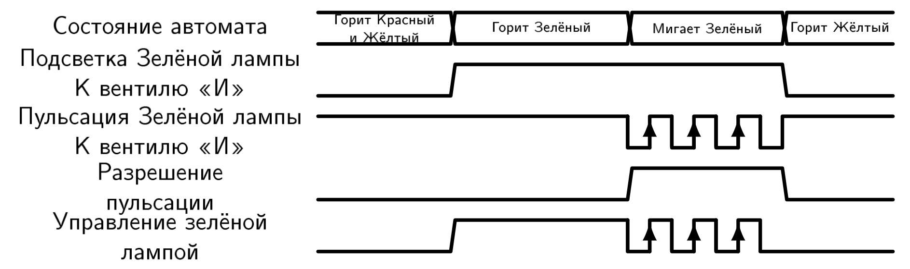

Схему пульсации можно использовать также для того чтобы мигать желтой лампой светофора.

Вспомним, что в цифровой схемотехнике нельзя закорачивать выходы цифровых блоков. Для того чтобы соединить выходы, необходимо использовать подходящие логические вентили.

Также вспомним, что автомат может прибывать только в одном своем состоянии.

Тогда общая схема будет выглядеть следующим образом:


Несмотря на внушительный вид это довольно простая схема:

Схема пульсации включается, когда автомат находится в состоянии "Мигает Зеленый" **ИЛИ** "Мигает Желтый".

Зеленая лампа подсвечивается, когда автомат находится в состоянии "Горит Зеленый" **ИЛИ** "Мигает Зеленый" **И** при этом выход схемы пульсации равен единице.

Для желтой лампы ситуация аналогична ситуации для зеленой лампы.

В форме поведенческого кода данная схема выглядит еще проще для понимания:

```systemverilog
logic green_light;
logic yellow_light;
logic blink_en;
logic blink;

assign green_light  = (state_ff == GREEN) | (state_ff == GREEN_BLINKING);
assign yellow_light = (state_ff == YELLOW) | (state_ff == YELLOW_BLINKING);
assign blinking_en  = (state_ff == GREEN_BLINKING) | (state_ff == YELLOW_BLINKING);

//код, описывающий поведение схемы пульсации
//выход схемы – сигнал blink
always @(posedge clk) begin
  if (blinking_en = 1) then
  ... // опустим описание
end


assign green  = green_light & blink;
assign yellow = yellow_light & blink;

```

Хотелось бы сразу отметить некоторую особенность реализации конечного автомата в виде цифрового устройства. Взгляните на следующий граф переходов:


Несмотря на примитивность, на его примере хорошо видно реакцию конечного автомата на внешнее воздействие.

Регистр состояния защелкивает новое состояние каждый такт, поэтому для того, чтобы автомат переключился из состояния "1" в состояние "2", требуется, чтобы входное воздействие "a" имело единичную длительность.

В противном случае автомат переключится из состояния "1" в состояние "2", затем, на следующий такт автомат переключится из состояния "2" в состояние "1" и так далее, пока не закончится входное воздействие.

Сравните временные диаграммы ниже, чтобы лучше почувствовать разницу.

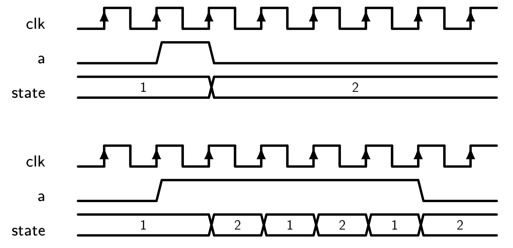

Кроме разделения режимов работы конечные автоматы позволяют цифровым устройствам "выполнять" некоторые алгоритмы действий. Ведь мы можем и не ставить условий для перехода из некоторых состояний в другие. Посмотрите на граф ниже - он очень напоминает алгоритм программы.


Мы вполне можем описать автомат, реализующий этот граф переходов:

```systemverilog
localparam IDLE            = 3'b000;
localparam CALC_CHECKSUM   = 3'b001;
localparam SEND_DATA       = 3'b010;
localparam WAIT_ANSWER     = 3'b011;
localparam ANALYZE_ANSWER  = 3'b100;
localparam TRY_SECOND_TIME = 3'b101;
localparam ERROR           = 3'b110;

logic [2:0] state_ff;
logic [2:0] state_next

always_comb begin
    case (state_ff)
      IDLE:
        if (new_data)
          next_state = CALC_CHECKSUM;
      CALC_CHECKSUM:
        if (checksum_calc_complete)
          next_state = SEND_DATA;
      SEND_DATA:
        next_state = WAIT_ANSWER;
      WAIT_ANSWER:
        if (answer_recived)
          next_state = ANALYZE_ANSWER;
        else if (wait_too_long)
          next_state = TRY_SECOND_TIME;
      ANALYZE_ANSWER:
        if (answer_is_ok)
          next_state = IDLE;
        else
          next_state = TRY_SECOND_TIME;
      TRY_SECOND_TIME:
        if (already_tried)
          next_state = ERROR;
        else
          next_state = SEND_DATA;
      ERROR:
        if (reset_error)
          next_state = IDLE;
      default: next_state = ERROR;
    endcase
end

always_ff @(posedge clk or posedge rst) begin
  if (rst)
    state_ff <= IDLE;
  else
    state_ff <= state_next;
end

```

Отметим некоторые особенности таких автоматов. Обратите внимание на условия переходов. Условия присутствуют практически во всех состояниях, даже если переход между ними линеен. Например, переход из состояния "calc_checksum" в состояние "send_data". Если для вычисления контрольной суммы требуется более одного такта, то без проверки выполнена ли операция нельзя покидать состояние вычисления контрольной суммы.

Разберем структуру цифрового устройства, которым будет управлять приведенный выше конечный автомат.


Как разработать подобную структуру?

Первое, что необходимо понимать, что блоки цифровых устройств существуют вне зависимости от того, используются ли они в данный момент или нет.

Теперь мы постараемся разбить устройство на блоки, определить функционал каждого из этих блоков и соединить их между собой.

Начинается разработка схемы с конечного автомата.

Наш конечный автомат уже разработан. Его мы помещаем в центр будущей структуры. Выходом конечного автомата служит текущее состояние. Именно его анализируют все остальные блоки устройства.

Теперь, когда мы поместили конечный автомат, приступим к проектированию периферии. Сначала регистр для того, чтобы защелкнуть и сохранить данные, которые в дальнейшем будем обрабатывать и передавать.

Когда необходимо защелкнуть данные? В самом начале работы. Т.е. в состоянии "idle", в момент, когда на вход пришел сигнал "new_data".

Идем дальше по алгоритму работы автомата. Теперь автомат переключился в состояние "calc_checksum". В структуру устройства необходимо добавить модуль, который будет считать контрольную сумму. Этот модуль будет производить вычисления, только когда автомат находится в состоянии "calc_checksum". После окончания вычисления контрольная сумма должна быть на выходе этого модуля и больше не должна меняться. Также этот модуль после завершения вычисления контрольной суммы должен выработать признак "checksum_calc_complete" для конечного автомата. Контрольную сумму можно сбросить в состоянии "idle".

Теперь автомат переходит в состояние "send_data". Для отправки уже должен быть сформирован пакет из данных и контрольной суммы (например, в виде объединенных шин).

Чаще всего контроллеры работают следующим образом. По сигналу разрешения записи данные с входа помещаются во внутренний регистр и, затем, начинается их отправка.

Именно поэтому мы использовали состояние, в котором наш конечный автомат проводит только один такт. Именно в этом состоянии происходит загрузка и запуск передатчика, а именно выработка сигнала "разрешение записи" для него.

Далее автомат попадает в состояние ожидание ответа. Для получения ответа, нам понадобится модуль приемника. Модуль приемника будет выставлять на шину значение принятых данных, а также он должен будет вырабатывать сигнал answer_received для работы конечного автомата.

Для функционирования конечного автомата нам также понадобится сигнал "waiting_too_long", который сигнализирует об отсутствии ответа в течение слишком большего времени. Чтобы выработать такой сигнал, поместим в устройство счётчик, который будет работать все время, пока автомат находится в состоянии "waiting_for_answer". Счётчик, при достижении максимального значения (которое мы зададим самостоятельно) будет вырабатываться сигнал "waiting_too_long". Обычно его называют "сторожевой счётчик".

Итак, если ответ получен, то его надо обработать. Мы разработали конечный автомат так, что обработка должна произойти за один такт, ведь в состоянии "analyze_answer" нет условий, говорящих о конце обработки. Внесем в устройство модуль, анализирующий ответ, полученный модулем приемника.

Осталось только одно состояние, в котором мы не определили входные данные для конечного автомата. Это состояние "try_second_time". Нам понадобится схема, вырабатывающая сигнал "already_tried".

Это довольно простая схема: регистр, на вход которого подается единица. Регистр сбрасывается в состоянии "idle", а запись в него разрешена только в состоянии "try_second_time". Выход этого регистра и есть "already_tried".

Когда мы попадаем в состояние "try_second_time", мы видим, что в регистре записан "0", и переходим в состояние "send_data" для повторной отправки данных. В этот же момент времени происходит запись "1" в регистр. Теперь, если мы снова окажемся в состоянии "try_second_time", мы увидим в регистре "1" и не будем осуществлять повторную отправку данных.

Таким образом, мы закончили описание структуры нашего цифрового устройства. Мы знаем, из каких модулей оно должно состоять и как должен функционировать каждый из этих модулей.

В рамках данной лабораторной работы нас не интересует конкретная реализация модулей. Но стоит заметить, что начав описание тех или иных из них, разработчик может столкнуться с необходимостью добавить новые управляющие сигналы, ввести новые состояния конечного автомата или добавить новые связи.

Эти случаи вовсе не редкость. При проектировании цифровых устройств, практически каждый разработчик неоднократно корректирует изначально разработанную им структуру. Как правило, по мере получения опыта уменьшается количество подобных правок.

Вы увидели, как разрабатывается структура цифровых устройств, включающих конечные автоматы.

Вы убедились, что структуры, необходимые для реализации тех или иных действий существуют одновременно, поэтому исполнение некоторых алгоритмов может быть связано с очень большими аппаратными затратами.

В таких случаях используют другие подходы к построению цифровых устройств, например, использование вычислительных ядер с программным управлением, с устройством которых вы познакомитесь в курсе "Микропроцессорные системы и средства".

Тем не менее, выполнение простых алгоритмов, например, алгоритмов управления с малым количеством ветвлений, часто перекладывается на конечные автоматы с целью минимизации программного кода и ускорения работы.

## Задание лабораторной работы
1. Изучить разработку к лабораторной работе.
2. Реализовать конечный автомат, согласно индивидуальному заданию.
3. Ответьте на вопросы к защите лабораторной работы.

Пример задания лабораторной работы:


## Варианты индивидуальных заданий

1. Граф конечного автомата:

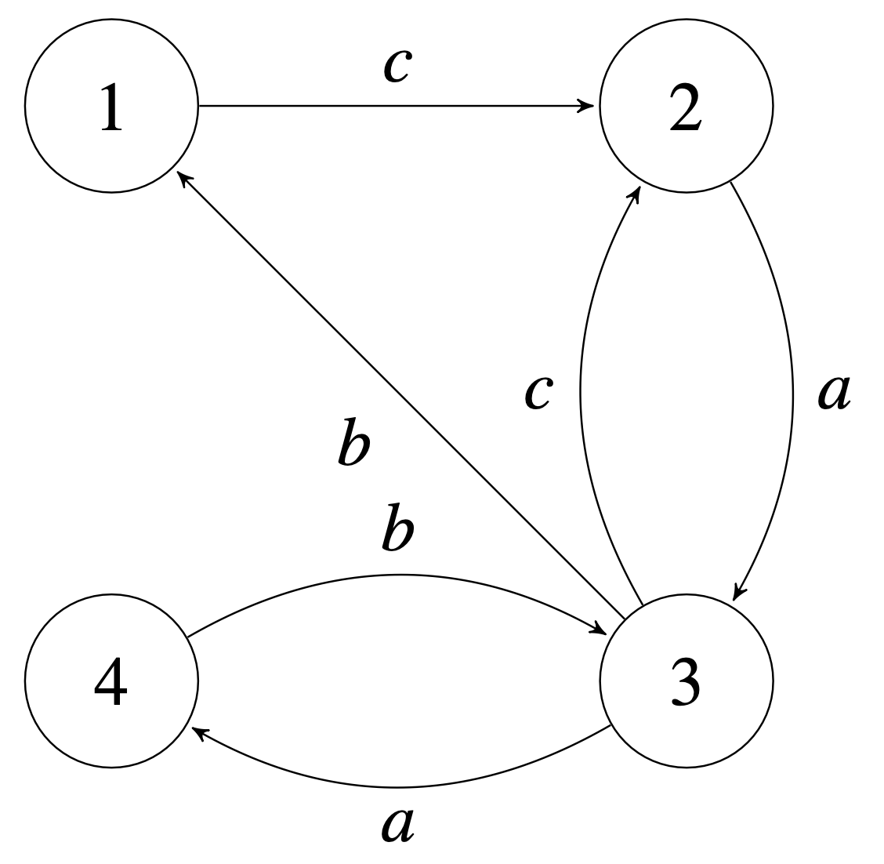

2. Граф конечного автомата:

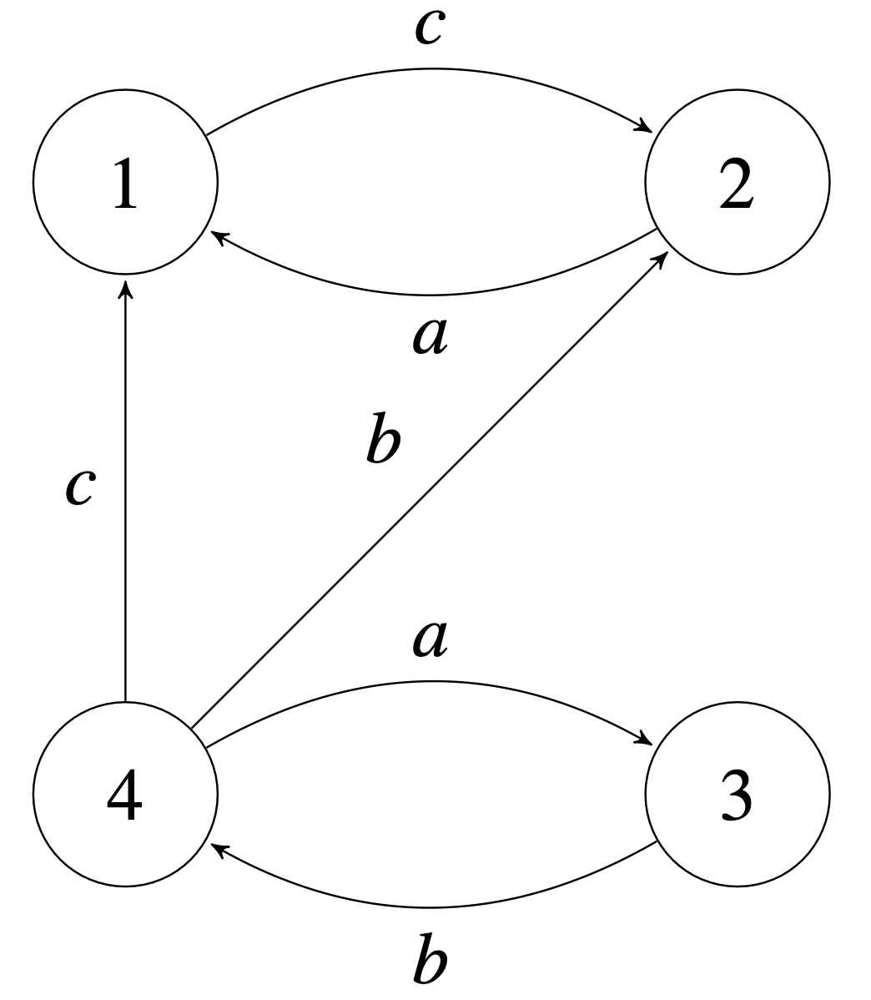

3. Граф конечного автомата:

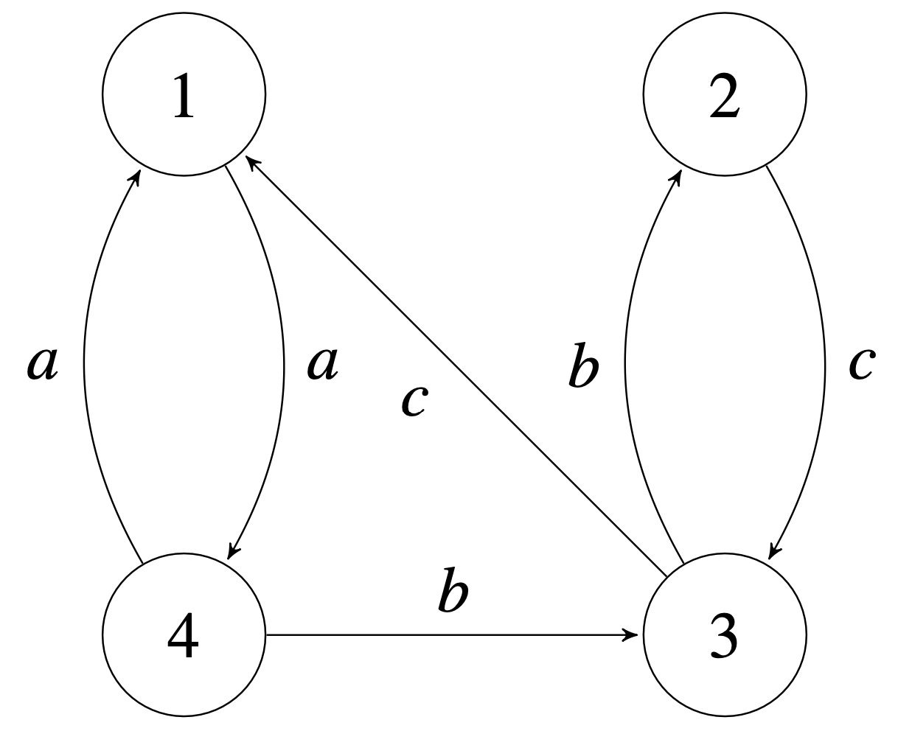

4. Граф конечного автомата:

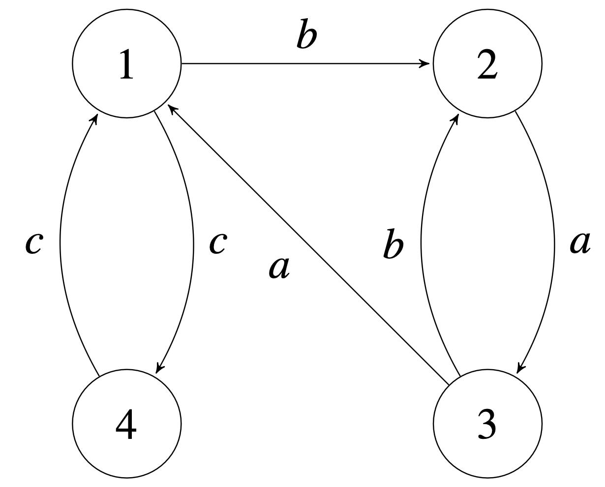

5. Граф конечного автомата:

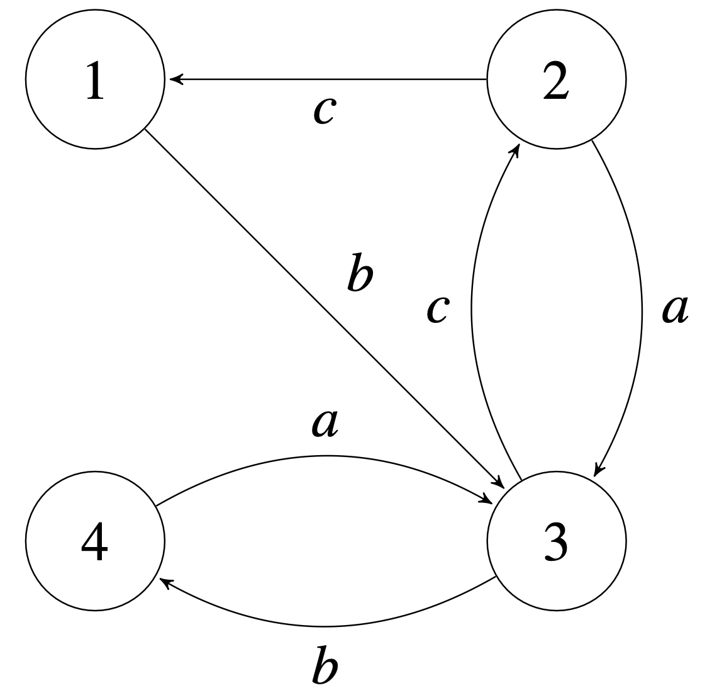

6. Граф конечного автомата:

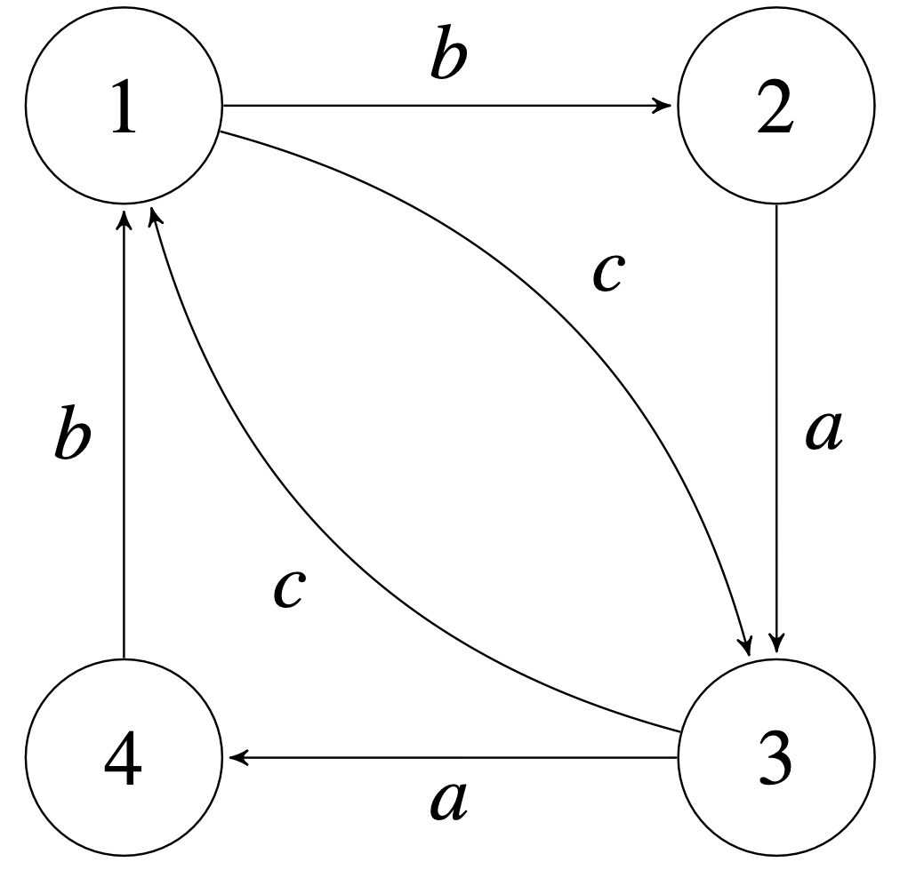

7. Граф конечного автомата:


8. Граф конечного автомата:

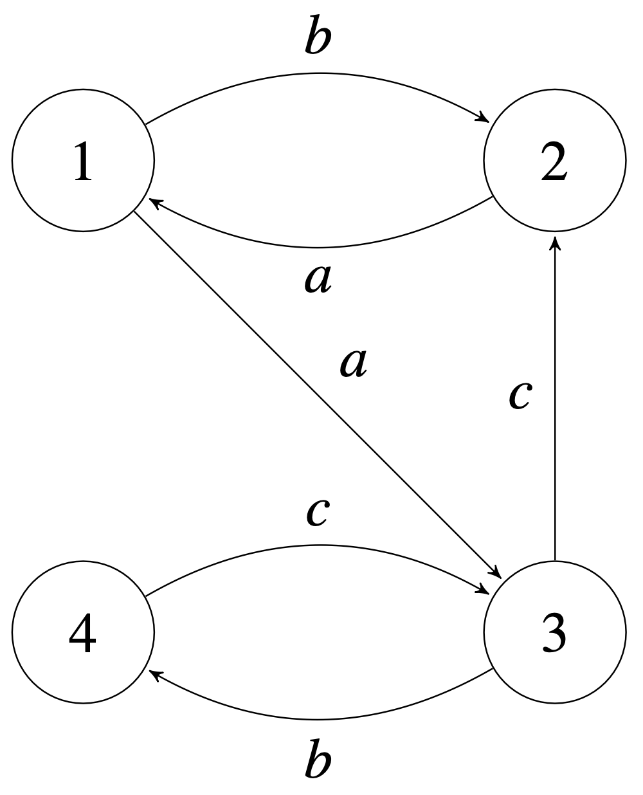

9. Граф конечного автомата:

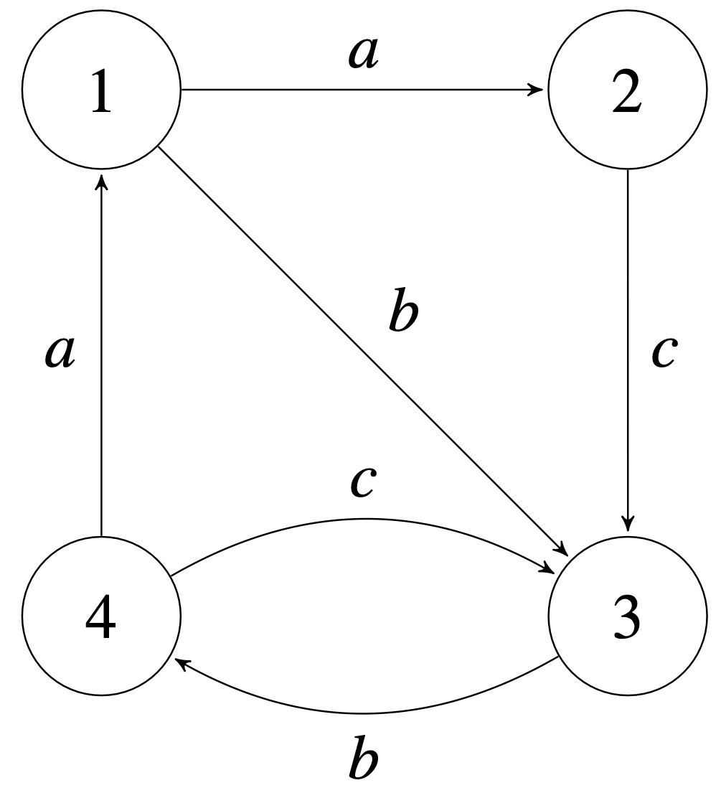

10.  Граф конечного автомата:

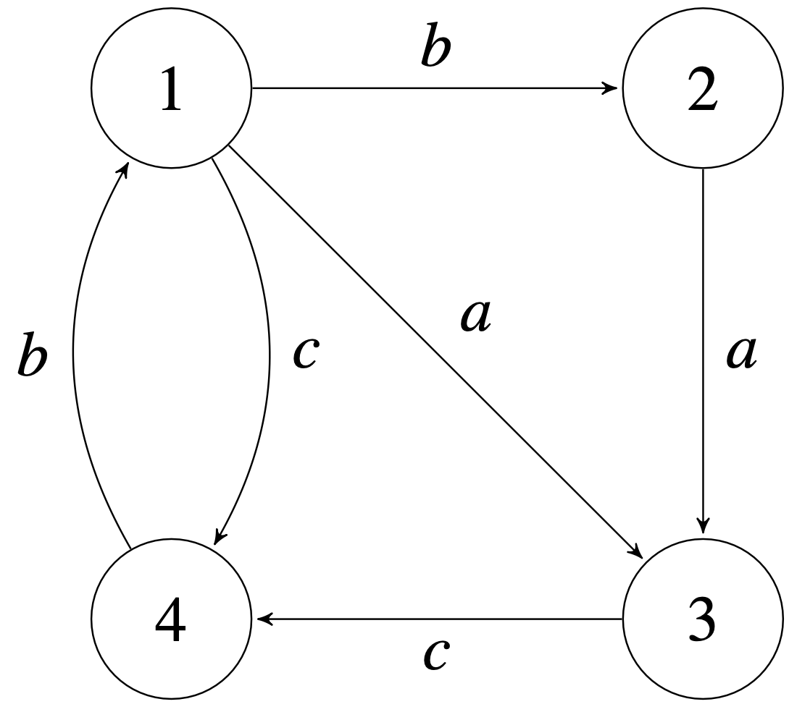


## Вопросы к защите лабораторной работы
  1. Что такое конечный автомат?
  2. Для чего конечные автоматы используются в цифровых устройствах?
  3. Из каких цифровых блоков состоит конечный автомат?
  4. Конечный автомат это синхронное или асинхронное устройство?
  5. Работу какого цифрового блока конечного автомата определяет граф переходов?
  6. Почему для верного функционирования конечного автомата важна длительность управляющих сигналов?
  7. Изучите рисунок схемы управления лампами светофора. Назовите значение состояния автомата, анализируемое каждым из компараторов.
