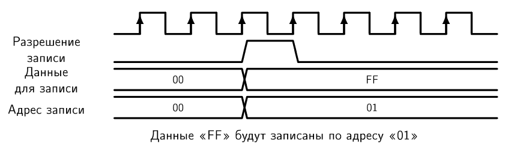
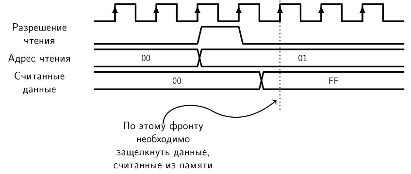
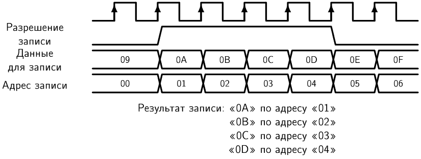

# RAM-память и FIFO

Мы уже познакомились с многими блоками, из который состоят цифровые устройства. Последний базовый строительный блок, который мы рассмотрим в этом курсе — память с произвольным доступом **Random Access Memory**.

RAM память в цифровых устройствах делится на три типа:
- Статическая память
- Динамическая память
- Энергонезависимая память

Статическая память по принципу работы похожа на набор регистров. Данные, которые были записаны в память, хранятся в ней, пока на цифровое устройство подается питание. Когда питание отключают, данные стираются из памяти.

Основным запоминающим элементом этого типа памяти является защелка. Такая память требует довольно большого количества ресурсов для своей реализации.

Динамическая память использует другой принцип хранения информации. В качестве элемента памяти в динамической памяти используются конденсаторы. Когда конденсатор заряжен — ячейка хранит `1`. Когда разряжен — `0`. Эта схема гораздо проще в реализации и требует существенно меньше ресурсов по сравнению со статической памятью. А значит на одном кристалле можно разместить большее количество памяти.

Но конденсатор неизбежно со временем разряжается через сопротивления утечки. Поэтому динамическая память требует постоянного обновления данных, которые были туда записаны. Обновление происходит благодаря внутреннему контроллеру, который проходит по всем адресам в памяти, считывая данные, а затем записывая эти же данные обратно и таким образом обновляет заряд конденсаторов.

Минусом динамической памяти является большое потребление тока, по сравнению со статической.

Наиболее известным представителем энергонезависимой памяти на данный момент является Flash память. Flash память базируется на транзисторах с плавающим затвором.

Выделяют два вида Flash памяти — NOR и NAND. Последняя получила наибольшее настроение.

У Flash памяти есть недостатки:
- деградация ячеек памяти, при повторной перезаписи информации
- деградация ячеек памяти при чтении (аналогично записи, но значительно медленнее)
- блочная организация (удалить можно только блока информации целиком)

В рамках нашего курса мы познакомимся со статической памятью, как наиболее часто применяющейся в качестве встроенной в цифровых устройствах.

Возможно, вы уже знаете основные принципы функционирования памяти в цифровой технике. Тем не менее, напомним, каким образом работает RAM память.

Сначала разберем, какие входы и выходы необходимы для полноценной работы памяти.

**Обратите внимание, что память является синхронным устройством и требует сигнала синхронизации**

Как происходит запись данных в память и чтение из неё?

На вход **данные для записи** подаются данные, которые мы хотели бы записать в память. Одновременно с этим на вход **адрес записи** подается адрес ячейки, в которую мы хотели поместить входные данные. Запись происходит по положительному фронту сигнала синхронизации, когда вход **запись разрешена** находится в `1`.

Посмотрите на временную диаграмму записи данных в память:

Чтение из RAM памяти происходит следующим образом: на вход **адрес чтения** подается адрес ячейки, из которой мы хотим получить данные, затем на вход **разрешение чтения** подается `1`. По положительному фронту сигнала синхронизации данные выгружаются из памяти и становятся доступны для чтения:

**Обратите внимание, что как в случае записи, так и в случае чтения, управляющие сигналы "запись разрешена" и "чтение разрешено" для однократной операции записи или чтения должны иметь длительность равную одному такту.**

Посмотрите на временную диаграмму, демонстрирующую запись большого количества данных в память:

Обратите внимание на смещение считанных данных при последовательном чтении информации из памяти:

Как же устроена статическая RAM-память?

Общую структуру статической памяти можно представить следующим образом:

Как мы уже говорили выше, использование триггеров и регистров для хранения большого количества данных оказалось не эффективно. RAM память строится на основе массива запоминающих блоков.

Обычно каждый бит данных подается на столбец, а ячейка столбца, в которую произойдет запись, выбирается в зависимости от адреса. Т.е. нулевой бит, всегда подается на нулевой столбец, и, в зависимости от адреса, нулевой бит будет записан в конкретную ячейку нулевого столбца.

Чтение происходит подобным образом: адрес выбирает по одной ячейке из каждого столбца и из значений этих ячеек формируется вектор выходных данных.

Для того чтобы обеспечить управление работой массива памяти в ней присутствует схема управления и входной регистр для фиксации входных данных и адреса.

Обратите внимание, что схема управления тоже имеет регистр для хранения сигналов разрешения записи и разрешения чтения.

Данные, считанные из памяти поступают на защелку, поведение которой (разрешен ли приём или выбран режим хранения) также контролируется схемой управления.

На основе RAM памяти строятся некоторые другие виды памяти.

Из них очень часто в цифровых устройствах встречается буфер. Буферный блок представляет собой память, организованную следующим образом: новые данные всегда записываются в конец памяти, а считываются всегда из её начала.

В англоязычной литературе такой блок памяти носит название FIFO от словосочетания First In First Out – Первый Пришел Первый Ушел. Название FIFO настолько широко распространено, что оно практически вытеснило русское название "очередь".

Так как данные всегда записываются в конец очереди, а читаются всегда из её начала, то интерфейс FIFO не содержит адресной шины.

В основе FIFO, как мы уже говорили, лежит RAM память, а очередь организуется за счет управляющего блока, специально подготавливающего адреса чтения и записи.

Запись происходит с нулевого адреса. После помещения информации в память, управляющий блок увеличивает адрес на единицу. Чтение происходит точно также, начиная с нулевого адреса. Когда происходит чтение, адрес чтения также увеличивается на единицу. Управляющему блоку необходимо следить, чтобы адрес чтения не "перегонял" адрес записи.

Все ячейки, адреса которых находятся между адресом чтения и адресом записи — заполнены, а все ячейки, адреса которых находятся снаружи этих адресов — пусты.

Также управляющий блок вырабатывает сигналы, описывающие состояние очереди: пуста - означает, что в очереди нет данных и полна - означает, что в очереди нет места для новых данных.

Подумайте, каким образом устройство управления может выработать эти сигналы?

Также часто в FIFO добавляют дополнительные признаки: почти пуста - означает, что в очереди только одно значение и {почти полна - означает, что есть только одна свободная ячейка. Эти сигналы в некоторых случаях облегчают работу с FIFO.

С точки зрения управления записью и чтением, FIFO работает также, как и блок RAM памяти, т.е. требует сигналов разрешения записи и разрешения чтения.

FIFO часто применяют в качестве буфера, для того, чтобы сохранить быстро поступающую информацию и, в дальнейшем, обработать её. Такой блок часто можно встретить в контроллерах интерфейсов, где обмен данными часто происходит волнами.

## Задание лабораторной работы:

- Изучить разработку к лабораторной работе.
- Разработать цифровое устройство, функционирующее согласно следующим принципам:
  - Нажатие кнопки приводит к увеличению текущего значения счётчика на единицу.
  - Одновременно с этим текущее значение счётчика должно быть записано в буфер FIFO.
  - Если в FIFO есть данные, то их выгрузка должна производиться один раз в секунду (одно слово в секунду).
  - Выгруженное значение должно отображаться на семисегментных индикаторах в шестнадцатеричной форме.
- Провести моделирование работы данного цифрового устройства и продемонстрировать результат.
- Получить файл конфигурации для ПЛИС учебного стенда и продемонстрировать работу устройства.

## Вопросы к защите лабораторной работы
- Что такое RAM-память?
- Изобразите обобщенную структуру RAM-памяти.
- RAM-память это синхронное или асинхронное устройство?
- Опишите все входные и выходные сигналы RAM памяти, известные вам.
- Нарисуйте временную диаграмму записи значения в RAM память.
- Нарисуйте временную диаграмму чтения значения из RAM памяти.
- Как функционирует буфер FIFO?
- Опишите все входные и выходные сигналы FIFO памяти, известные вам.
