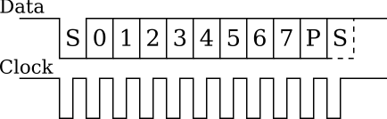
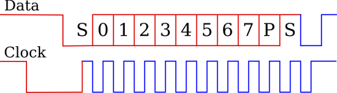

# Контроллер PS/2 для клавиатуры

Для успешного применения цифровых устройств в реальности важно обеспечить их взаимодействие с внешним миром. Для этого существуют внешние интерфейсы для обмена информацией с другими устройствами и приборами. Внешние интерфейсы имеют различное функциональное назначение и спецификацию. Например, раньше для подключения клавиатуры и мыши использовался интерфейс PS/2. Один с самых простых способов подключения устройств ввода-вывода.


Давайте изучим протокол и реализацию интерфейса PS/2.

Интерфейс PS/2 сточки зрения соединения представляет собой два провода Clock и Data. По Clock передаются синхроимпульсы, а по Data предаются данные. На рисунке пример одной транзакции обмена.




Структура транзакции похожа на UART и состоит из:

- старт бит – всегда ноль
- 8 бит данных
- бит четности, равен 1 если количество единиц в данных четно и 0 если нечетно
- стоп бит – всегда единица


Данные на линию выставляются, когда Clock равен **1** и считываются, когда Clock равен **0**. На практике данные обычно выставляются по положительному фронту и считываются по отрицательному.

Частота сигнала Clock примерно 10-16.7кГц. Время от фронта сигнала Clock до момента изменения сигнала Data не менее 5 микросекунд.


Транзакции разделяются на два вида:

 - От устройства к контроллеру;
 - От контроллера к устройству.


На примере клавиатуры.

 - Клавиатура посылает на контроллер восьмибитный код нажатой клавиши;
 - Контроллер посылает на клавиатуру команды управления. Такие как, команды сброса, выключения светодиодов.


При транзакции от устройства (клавиатуры) к контроллеру сигналы на линиях Clock и Data генерирует устройство. Контроллер выступает в роли приемника считывая данные по отрицательному фронту Clock.

При передаче в обратную сторону команд от контроллера к клавиатуре или мыши протокол отличается от описанного выше.

Последовательность обмена другая:
 - контроллер опускает сигнал Clock в ноль на время примерно 100 микросекунд;
 - контроллер опускает сигнал Data в ноль формируя старт бит;
 - контроллер отпускает сигнал Clock в логическую единицу, клавиатура фиксирует старт бит;
 - далее клавиатура генерирует сигнал Clock, а хост контроллер подает передаваемые биты;
 - после того, как контроллер передал все свои биты, включая бит четности и стоп бит, клавиатура посылает последний бит «ноль», который является подтверждением приема.



Поскольку одним сигналом управляют два устройства, то довольно трудно понять, кто в какой момент времени управляет сигналом. По этому, диаграмма нарисована двумя цветами. Красный цвет – сигнал управляется контроллером, а синий – сигнал управляется устройством.


Давайте выясним какие коды же коды передает клавиатура для каждой клавиши.

Ниже приведена таблица кодов для клавиш. Каждой клавише соответствует код генерируемый при нажатии и код генерируемый при деактивации. Коды состоящие из нескольких байтов предаются в нескольких подряд идущих транзакций.


| KEY | MAKE | BREAK | KEY | MAKE | BREAK |
| --- | ---- | ----- | --- | ---- | ----- |
| A | 1C | F0,1C | R ALT | E0,11 | E0,F0,11  |
| B | 32 | F0,32 | APPS  | E0,2F | E0,F0,2F  |
| C | 21 | F0,21 | ENTER | 5A | F0,5A        |
| D | 23 | F0,23 | ESC   | 76 | F0,76        |
| E | 24 | F0,24 | F1 | 05 | F0,05           |
| F | 2B | F0,2B | F2 | 06 | F0,06           |
| G | 34 | F0,34 | F3 | 04 | F0,04           |
| H | 33 | F0,33 | F4 | 0C | F0,0C           |
| I | 43 | F0,43 | F5 | 03 | F0,03           |
| J | 3B | F0,3B | F6 | 0B | F0,0B           |
| K | 42 | F0,42 | F7 | 83 | F0,83           |
| L | 4B | F0,4B | F8 | 0A | F0,0A           |
| M | 3A | F0,3A | F9 | 01 | F0,01           |
| N | 31 | F0,31 | F10 | 09 | F0,09          |
| O | 44 | F0,44 | F11 | 78 | F0,78          |
| P | 4D | F0,4D | F12 | 07 | F0,07          |
| Q | 15 | F0,15 | SCROLL | 7E | F0,7E       |
| R | 2D | F0,2D | [ | 54 | FO,54            |
| S | 1B | F0,1B | INSERT | E0,70 | E0,F0,70 |
| T | 2C | F0,2C | HOME | E0,6C | E0,F0,6C   |
| U | 3C | F0,3C | PG UP | E0,7D | E0,F0,7D  |
| V | 2A | F0,2A | DELETE | E0,71 | E0,F0,71 |
| W | 1D | F0,1D | END | E0,69 | E0,F0,69    |
| X | 22 | F0,22 | PG DN | E0,7A | E0,F0,7A  |
| Y | 35 | F0,35 | UP | E0,75 | E0,F0,75     |
| Z | 1A | F0,1A | LEFT | E0,6B | E0,F0,6B   |
| 0 | 45 | F0,45 | DOWN |  E0,72 | E0,F0,72  |
| 1 | 16 | F0,16 | RIGHT |  E0,74 | E0,F0,74 |
| 2 | 1E | F0,1E | NUM | 77 | F0,77          |
| 3 | 26 | F0,26 | KP / | E0,4A | E0,F0,4A   |
| 4 | 25 | F0,25 | KP * | 7C | F0,7C         |
| 5 | 2E | F0,2E | KP - | 7B | F0,7B         |
| 6 | 36 | F0,36 | KP + | 79 | F0,79         |
| 7 | 3D | F0,3D | KP EN | E0,5A | E0,F0,5A  |
| 8 | 3E | F0,3E | KP . | 71 | F0,71         |
| 9 | 46 | F0,46 | KP 0 | 70 | F0,70         |
| ` | 0E | F0,0E | KP 1 | 69 | F0,69         |
| - | 4E | F0,4E | KP 2 | 72 | F0,72         |
| = | 55 | F0,55 | KP 3 | 7A | F0,7A         |
| \ | 5D | F0,5D | KP 4 | 6B | F0,6B         |
| BKSP |   66 | F0,66 | KP 5 | 73 | F0,73    |
| SPACE |  29 | F0,29 | KP 6 | 74 | F0,74    |
| TAB  |   0D | F0,0D | KP 7 | 6C | F0,6C    |
| CAPS  |  58 | F0,58 | KP 8 | 75 | F0,75    |
| L SHFT | 12 | FO,12 | KP 9 | 7D | F0,7D    |
| L CTRL | 14 | FO,14 | ] | 5B | F0,5B       |
| L GUI  | E0,1F | E0,F0,1F | ; | 4C | F0,4C |
| L ALT  | 11 | F0,11 | ' | 52 | F0,52       |
| R SHFT | 59 | F0,59 | , | 41 | F0,41       |
| R CTRL | E0,14 | E0,F0,14 | . | 49 | F0,49 |
| R GUI  | E0,27 | E0,F0,27 | / | 4A | F0,4A |


Разработаем простой контроллер для клавиатуры. Контроллер предназначается для работы только в режиме устройство-контроллер.

Для начала определим функционал контроллера и набор сигналов.

Функционал:
 - Считываются данные с линии PS/2 по отрицательному фронту синхросигнала;
 - Проверяется корректность принятых данных. Проверяется стоп бит, бит четности и стартовый бит;
 - Выводит принятые данные на внешнюю шину и формирует сигнал готовности данных.

Набор сигналов:
 - areset – асинхронный сброс, активный уровень **1**;
 - clk_50 – вход тактовой частоты с частотой 50 МГц;
 - Data – восьмибитная шина данных;
 - valid_Data – сигнал готовности данных, равен **1** с момента завершения приема по PS/2 до начала следующей транзакции;
 - ps2_clk – тактовая линия PS/2, является внешним сигналом для ПЛИС;
 - ps2_dat – сигнальная линия PS/2, является внешним сигналом для ПЛИС.


**Примечание. Сигналы ps2_clk и ps2_dat как внешние сигналы необходимо подключить к соответствующим пинам ПЛИС. Это пины H15(ps2_clk) J14(ps2_dat), к которым на плате DE1 подключен коннектор PS/2.**

Описание входов и выходов контроллера:

```verilog
module ps2_keyboard(
  input  logic areset,
  input  logic clk_50,

  input  logic ps2_clk,
  input  logic ps2_dat,

  output logic valid_data,
  output logic [7:0] data
);

```


Прежде всего, необходимо надежно определять нисходящий фронт сигнала ps2_clk, так как его качество (крутизна фронтов, зашумленность) может сильно варьироваться в зависимости от клавиатуры и непосредственное тактирование от этого сигнала может вызвать некорректную работу всей схемы в целом.

Для определения нисходящего фронта мы используем вариант схемы для работы с кнопками. Схема представляет из себя десятибитный сдвиговый регистр, в который каждый такт clk_50 сдвигается текущее значение ps2_clk. Схема ожидает момент, когда старшие 5 бит сдвигового регистра заполнены нулями, а младшие 5 бит -- единицами. В этот момент на 1 такт возводится сигнал ps2_clk_negedge, который используется в остальной схеме.

%\lstinputlisting[caption={Описание схемы определения нисходящего фронта сигнала ps2\_clk]{./code_examples/lab_6/clk_detect.v

Описание схемы определения нисходящего фронта сигнала ps2_clk:

```verilog
logic [9:0] ps2_clk_detect;

always_ff @(posedge clk_50 or posedge areset)
begin
  if(areset)
    ps2_clk_detect <= 10'd0;
  else
    ps2_clk_detect <= {ps2_clk, ps2_clk_detect[9:1]};
end

logic ps2_clk_negedge;
assign ps2_clk_negedge = (&ps2_clk_detect[4:0]) && (&(~ps2_clk_detect[9:5]));

```


Основой контроллера будет конечный автомат со следующей последовательностью действий:
 - Состояние покоя;
 - Прием стартового бита и его проверка. Если стартовый бит не равен 0 переходим в состояние покоя;
 - Прием данных;
 - Прием бита четности и стопового бита их проверка.
 - При правильных значениях стопового бита и бита четности формирования сигнала готовности данных.
 - Переход в состояние покоя.


Описание конечного автомата контроллера:

```verilog
logic [1:0] state;

localparam IDLE = 2'd0;
localparam RECEIVE_DATA = 2'd1;
localparam CHECK_PARITY_STOP_BITS = 2'd2;

always_ff @(posedge clk_50 or posedge areset) begin
  if(areset)
    state <= IDLE;
  else if (ps2_clk_negedge)
    begin
      case (state)
        IDLE:
        begin
          if(!ps2_dat)
            state <= RECEIVE_DATA;
        end

        RECEIVE_DATA:
        begin
          if (count_bit == 8)
            state <= CHECK_PARITY_STOP_BITS;
        end

        CHECK_PARITY_STOP_BITS:
        begin
          state <= IDLE;
        end

        default:
        begin
          state <= IDLE;
        end
      endcase
    end
end

```


Конечный автомат имеет три состояния IDLE, RECEIVE_DATA, CHECK_PARITY_STOP_BIT.

IDLE – состояние покоя в котором контроллер ожидает первого отрицательного фронта ps2_clk. Переход в состояние RECEIVE_DATA происходит по отрицательному фронту ps2_clk если ps2_dat равно 0, то есть пришел стартовый бит, иначе остаемся в IDLE.

RECEIVE_DATA – состояние в ходе, которого происходит прием данных и бита четности. Переход в состояние CHECK_PARITY_STOP_BIT происходит при счетчике бит равном 8. Отсчитано 8 бит данных и идет прием бита четности.

Последнее состояние CHECK_PARITY_STOP_BITS длительностью в один период ps2_clk. В CHECK_PARITY_STOP_BITS происходит проверка бита паритета и стопового бита.

Описание сдвигового регистра:

```verilog
logic  [8:0]  shift_reg;

assign data = shift_reg[7:0];

always_ff @(posedge clk_50 or posedge areset) begin
  if(areset)
    shift_reg <= 9'b0;
  else if (ps2_clk_negedge)
    if(state == RECEIVE_DATA)
      shift_reg <= {ps2_dat, shift_reg[8:1]};
end

```


Сдвиговый регистр необходим для приема и хранения данных и бита четности. По этому, разрядность регистра равна 9. По завершению транзакции в восьмом бите хранится бит четности с 7-0 бит данные. Данные непрерывным присваиванием выведены на внешнюю шину модуля.

Если обратиться к началу лабораторной работы то стоит заметить что данные передаются по интерфейсу PS/2 начиная с младшего бита. Логично будет использовать схему работы сдвигового регистра, при которой сдвиг происходит вправо. Таким образом, первый принятый бит окажется в 0 ячейке сдвигового регистра по окончании транзакции.

Запись в сдвиговый регистр происходит по отрицательному фронту ps2_clk и состоянию конечного автомата RECEIVE_DATA.

Описание счетчика принятых бит:

```verilog
logic  [3:0]  count_bit;

always_ff @(posedge clk_50 or posedge areset) begin
  if(areset)
    count_bit <= 4'b0;
  else if (ps2_clk_negedge) begin
    if(state == RECEIVE_DATA)
      count_bit <= count_bit + 4'b1;
    else
      count_bit <= 4'b0;
  end
end

```


Счетчик принятых бит служит для контроля за процессом приема. Инкрементация счетчика происходит только в состоянии RECEIVE_DATA.

Описание вырабатывания сигнала готовности к передаче:

```verilog
function parity_calc;
  input logic [7:0] a;
  parity_calc = ~(a[0] ^ a[1] ^ a[2] ^ a[3] ^
                  a[4] ^ a[5] ^ a[6] ^ a[7]);
endfunction

always_ff @(posedge clk_50 or posedge areset) begin
  if(areset)
    valid_data <= 1'b0;
  else if (ps2_clk_negedge)
    if (ps2_dat && (parity_calc(shift_reg[7:0]) == shift_reg[8]) && (state == CHECK_PARITY_STOP_BITS))
      valid_data <= 1'b1;
    else
      valid_data <= 1'b0;
end

```

Последним нерассмотренным моментом остался вопрос генерации сигнала готовности данных. Как было сказано ранее сигнал готовности генерируется к конце транзакции в случае успешного приема и равен 1 до начала следующей транзакции. То есть пока конечный автомат в состоянии IDLE.

Условием успешного окончания транзакции является стоповый бит равный 1 и бит четности равный рассчитанному значению.

Генерация сигнала готовности происходит в момент приема стопового бита. По этому для его проверки достаточно убедиться что значение на линии ps2\_dat равно 1.

Для проверки бита четности необходимо рассчитать четность принятых 8 бит данных и сравнить ее с значением бита четности. Для упрощения читаемости кода используется функция расчета честности для 8 разрядного регистра согласно правилу отрицания побитового XOR регистра. Правило расчета бита паритета можно узнать из стандарта на интерфейс PS/2.

## Полное описание контроллера PS/2

Пример реализации контроллера PS/2:

```verilog
module ps2_keyboard( 
  input  logic areset, 
  input  logic clk_50,

  input  logic ps2_clk, 
  input  logic ps2_dat, 
          
  output logic valid_data, 
  output logic [7:0] data
); 

logic [8:0] shift_reg;
logic [3:0] count_bit;

assign data = shift_reg[7:0];

function parity_calc;
  input logic [7:0] a;
  parity_calc = ~(a[0] ^ a[1] ^ a[2] ^ a[3] ^ a[4] ^ a[5] ^ a[6] ^ a[7]);
endfunction

logic [9:0] ps2_clk_detect;

always_ff @(posedge clk_50 or posedge areset)
begin
  if(areset)
    ps2_clk_detect <= 10'd0;
  else
    ps2_clk_detect <= {ps2_clk, ps2_clk_detect[9:1]};
end

logic ps2_clk_negedge;
assign ps2_clk_negedge = (&ps2_clk_detect[4:0]) && (&(~ps2_clk_detect[9:5]));


logic [1:0] state;

localparam IDLE = 2'd0;
localparam RECEIVE_DATA = 2'd1;
localparam CHECK_PARITY_STOP_BITS = 2'd2;

always_ff @(posedge clk_50 or posedge areset) begin
  if(areset)
    state <= IDLE;
  else if (ps2_clk_negedge)
    begin
      case (state)
        IDLE:
        begin
          if(!ps2_dat)
            state <= RECEIVE_DATA;
        end

        RECEIVE_DATA:
        begin
          if (count_bit == 8)
            state <= CHECK_PARITY_STOP_BITS;
        end

        CHECK_PARITY_STOP_BITS:
        begin
          state <= IDLE;
        end

        default:
        begin
          state <= IDLE;
        end
      endcase
    end
end

always_ff @(posedge clk_50 or posedge areset) begin
  if(areset)
    valid_data <= 1'b0;
  else if (ps2_clk_negedge)
    if (ps2_dat && (parity_calc(shift_reg[7:0]) == shift_reg[8]) && (state == CHECK_PARITY_STOP_BITS))
      valid_data <= 1'b1;
    else
      valid_data <= 1'b0;
end

always_ff @(posedge clk_50 or posedge areset) begin
  if(areset)
    shift_reg <= 9'b0;
  else if (ps2_clk_negedge)
    if(state == RECEIVE_DATA)
      shift_reg <= {ps2_dat, shift_reg[8:1]};
end

always_ff @(posedge clk_50 or posedge areset) begin
  if(areset)
    count_bit <= 4'b0;
  else if (ps2_clk_negedge) begin
    if(state == RECEIVE_DATA)
      count_bit <= count_bit + 4'b1;
    else
      count_bit <= 4'b0;
  end
end

endmodule

```

Для вашего удобства и эффективной отладки проекта предлагается пример тестбенча, содержащего task, имитирующий передачу данных по ps/2.

```verilog
module ps2_testbench ();


  logic clock;
  logic reset;

  logic ps2_clock;
  logic ps2_data;

  logic valid_data;
  logic [7:0] data;

  ps2_keyboard UUT(
          .areset     (reset),
          .clk_50     (clock),

          .ps2_clk    (ps2_clock),
          .ps2_dat    (ps2_data),

          .valid_data (valid_data),
          .data       (data));


  initial begin
    $dumpfile("out.vcd");
    $dumpvars;
  end

  initial begin
    clock = 0;
    reset = 0;

    ps2_clock = 1;
    ps2_data = 1;

    #20
    reset = 1;
    #20
    reset = 0;

    #5000
    ps2_send(8'hF1);
    ps2_send(8'hAB);

    #100
    $finish;

  end

  always
    #20 clock = ~clock;

  // Tasks


  localparam PS2_HALFPERIOD = 1000;
  logic [7:0] ps2_shiftreg;

  integer i;

  task ps2_send;
    input [7:0] data;

    begin
      ps2_shiftreg = data;

      // Start bit
      ps2_clock = 0;
      ps2_data  = 0;
      #PS2_HALFPERIOD;

      ps2_clock = 1;
      #PS2_HALFPERIOD;


      // Data
      for (i = 0; i < 8; i = i + 1) begin
        ps2_clock = 0;
        ps2_data  = ps2_shiftreg[0];
        ps2_shiftreg = ps2_shiftreg >> 1;
        #PS2_HALFPERIOD;

        ps2_clock    = 1;
        #PS2_HALFPERIOD;
      end


      // Parity
      ps2_clock = 0;
      ps2_data  = ~(^data);
      #PS2_HALFPERIOD;

      ps2_clock = 1;
      #PS2_HALFPERIOD;


      // Stop bit
      ps2_clock = 0;
      ps2_data  = 1;
      #PS2_HALFPERIOD;

      ps2_clock = 1;
      #PS2_HALFPERIOD;


      // One period delay
      #(PS2_HALFPERIOD * 2);
    end

  endtask


endmodule

```


## Задание лабораторной работы:
 - Ознакомиться с спецификацией на интерфейс PS/2 и представленной реализацией контроллера клавиатуры.

 - Подготовиться к выполнению индивидуального задания с использованием предложенного контроллера на лабораторной работе.


## Варианты индивидуальных заданий

- Выводить на семисегментные индикаторы только коды клавиш ''W'', ''A'', ''S'', ''D'' и ''пробел''.
- Выводить на семисегментные индикаторы только коды клавиш ''1'', ''3'', ''5'', ''7'', ''9''.
- Выводить на семисегментные индикаторы только коды клавиш, находящихся на num-pad.
- Выводить на семисегментные индикаторы только коды клавиш ''Q'', ''W'', ''E'', ''R'', ''T'', ''Y''.
- Выводить на семисегментные индикаторы только коды клавиш ''I'', ''D'', ''Q'', ''D''.
- Выводить на семисегментные индикаторы только коды клавиш со стрелками.
- Выводить на семисегментные индикаторы только коды клавиш ''I'', ''D'', ''K'', ''F'', ''A''.
- Выводить на семисегментные индикаторы только коды клавиш F1 -- F12.
- Выводить на семисегментные индикаторы только коды клавиш ''Z'', ''X'', ''C'', ''V'', ''B'', ''N''.
- Выводить на семисегментные индикаторы только коды клавиш ''L'', ''J'', ''S'', ''P'', ''Q'', ''K''.
