# Тестирование разработанного модуля
Разработка модуля характеризуется не только написанием модуля, описывающего принцип его работы, но и необходимостью доказать его работоспособность.
Работоспособность модуля можно доказать подавая на входы различные значения с последующим получением ожидаемого результата на выходах. В **SystemVerilog** для
базового тестирования модуля используются **тестбенч (testbench)** — это модуль, написанный на SystemVerilog, который не предназначен для синтеза (не превращается в схему). 
Его единственная цель — проверить функциональность синтезируемого модуля (DUT). Данный гайд несет в себе цель научить вас писать простейшие тесты. Проверять работоспособность своего модуля
с помощью тестов гораздо рациональнее хотя бы потому, что вам не приходится ждать по N минут момента, когда сгенерируется битстрим и вы увидите результат на плате. Помимо того, если ваш модуль
отработал неправильно, плата не скажет в каком месте возникла ошибка, а тестбенч (при должном его написании) — скажет.

## Структура гайда
1. [Создание testbench в Vivado](#Создание-testbench-в-Vivado)
2. [Привязка модуля к тестбенчу](#Привязка-модуля-к-тестбенчу)
3. [Запуск симуляции](#Запуск-симуляции)
4. [Initial блок](#Initial-блок)
   * [Тестирование комбинационной логики](#Тестирование-комбинационной-логики)
   * [Создание тактового сигнала для тестирования последовательстной логики](#Создание-тактового-сигнала-для-тестирования-последовательстной-логики)

## Создание testbench в Vivado
Представим, что у нас есть спроектированный модуль, который необходимо отверифицировать:
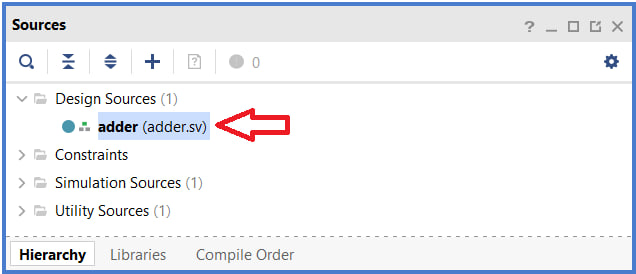

Для того, чтобы начать процесс создания тестбенча, необходимо правой кнопкой кликнуть по **Simulation Sources**, а затем кликнуть на **Add Sources...**:

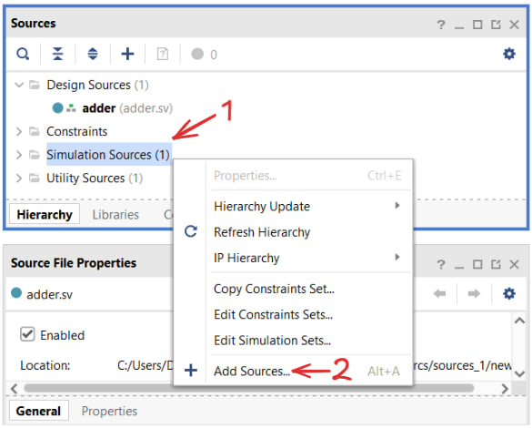

После этого откроется меню, в котором необходимо выбрать **Add or create simulation sources** и затем кликнуть **Next**:

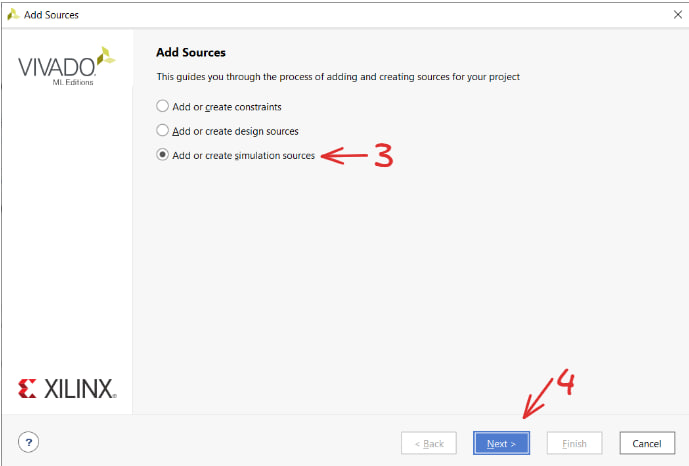

Далее откроется меню _Add or create simulation sources_, в нем выбираем **Create File** в случае, если нужно создать тестбенч, и **Add Files**, если тестбенч уже есть и его нужно просто добавить в проект:

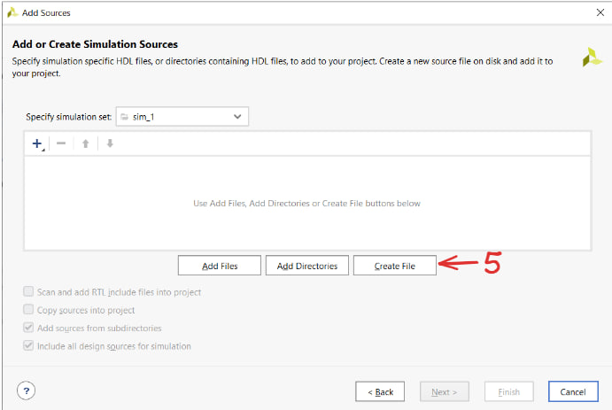

В случае выбора _Create File_, появится меню, в котором необходимо будет указать **File Type** и **File Name**. 
* Тип файла **SystemVerilog**.
* Имя файла можно указывать любым. Однако хорошей практикой считается имя, которое содержит в себе название тестируемого модуля с припиской **_tb**.
* Указав настройки выше, кликаем **OK**.

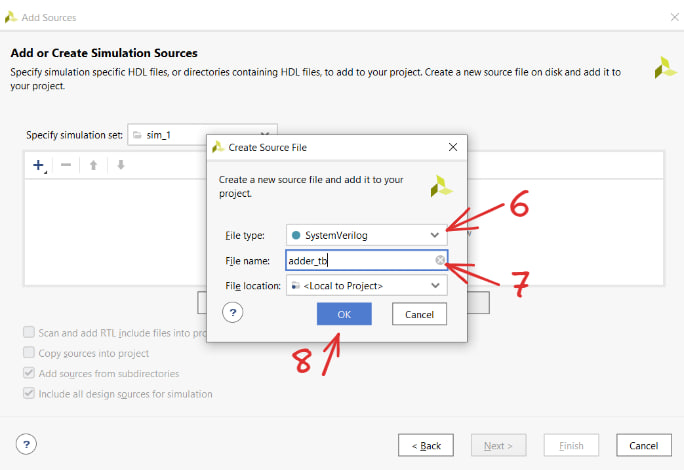

В окне, выделенном красным, появится информация о созданном/добавленном файле. Убедившись в том, что все необходимое создалось/добавилось, жмем **Finish**.

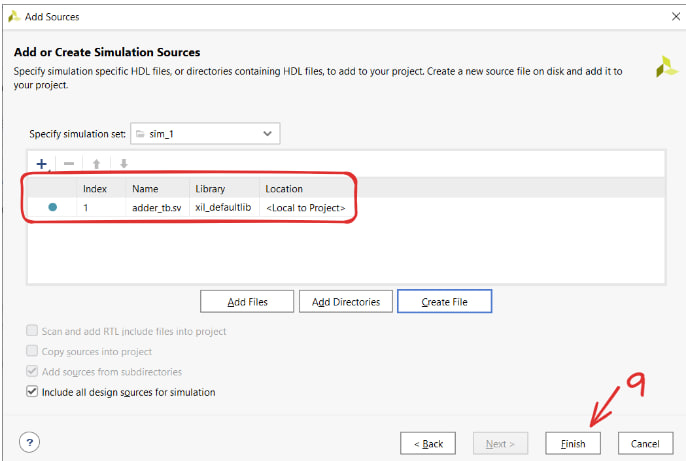

Появится еще одно окно, в котором кликаем **OK**

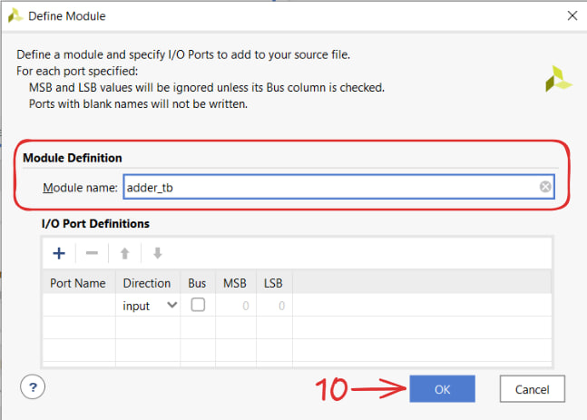

В следующем окне кликаем **Yes**

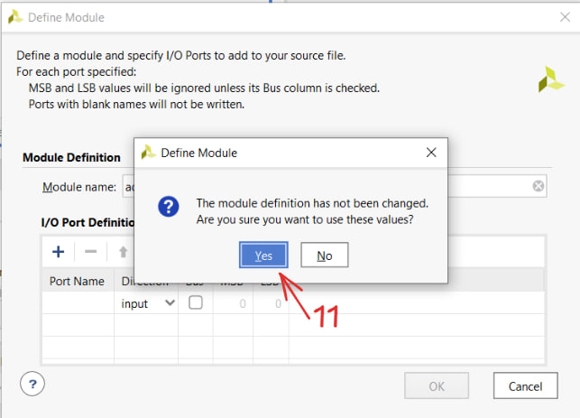

В результате в разделе **Simulation Sources/sim_1** появится созданный тестбенч

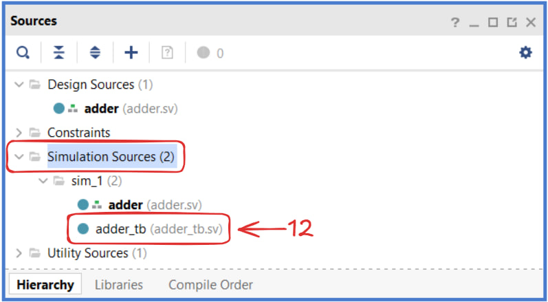

Однако только создать его недостаточно, его также необходимо назначить модулем верхнего уровня.
* Правой кнопкой кликаем по тестбенчу
* Выбираем опцию **Set as Top**

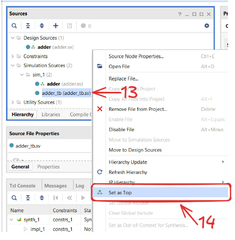

После выполнения всех шагов выше, создания модуля для тестирования можно считать завершенным.

## Привязка модуля к тестбенчу
Успешно создав модуль для тестирования, необходимо его привязать к модулю, работоспособность которого требуется проверить. Вы наверняка уже этим занимались, поэтому искренне надеюсь, что данный
процесс ни у кого не вызовет никаких вопросов. Ниже приведен пример привязки:

```verilog
module adder_tb();

logic[31:0] op1;
logic[31:0] op2;

logic[31:0] ans;

adder DUT(
  .a_i ( op1 ),
  .b_i ( op2 ),
  .c_o ( ans )
);
```

Из примера можно выделить следующее:
* В тестбенче **НЕ СОЗДАЮТСЯ** входы и выходы. Создаются только внутренние сигналы, которые затем подвязываются к входам и выходам тестируемого модуля.
* Чтобы полностью проверить работоспособность модуля, для каждого его входа нужно создать сигнал, который будет к нему привязан.
* В целом для выходов тестируемого модуля необязательно создавать сигналы в тестбенче, которые к этим выходам будут привязаны. Информацию о состоянии
выхода все равно можно будет получить. Как ее получить будет рассказано в следующем разделе.

## Запуск симуляции
Первым делом перед запуском симуляции убеждаемся в том, что в **Design Sources** и **Simulation Sources** в качестве модулей верхнего уровня выбраны правильные модули:

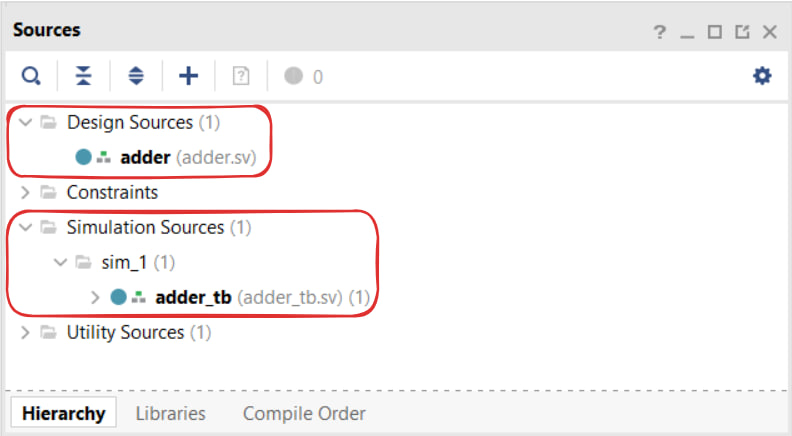

Убедившись в этом, в **Flow Navigator** ищем **Simulation** и жмем на **Run Simulation**. В меню выбора кликаем на **Run Behavioral Simulation**:

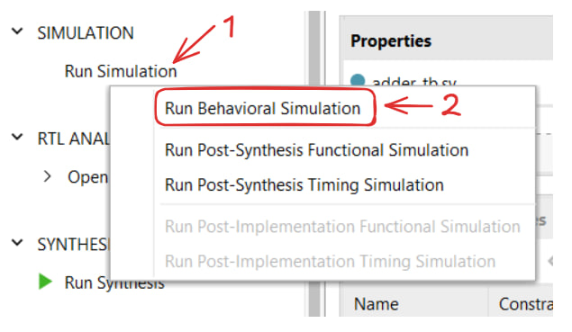

В результате откроется пугающее окно с множественным функционалом, который ниже будет разобран:

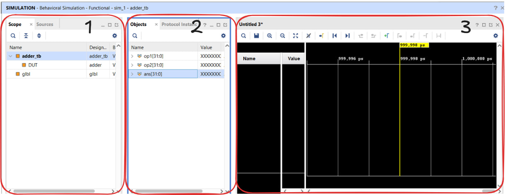

1. **Scope** - здесь указана иерархия модулей. Самым высоким модулем по иерархии является тестбенч. Тестируемый модуль **ВСЕГДА** находится по иерархии ниже, чем тестбенч.
2. **Objects** - здесь представлена информация о том, какие сигналы содержатся в выделенном в **Scope** модуле. На данном скриншоте мы видим сигналы из **adder_tb** т.к. именно он выделен
в **Scope**. Если выделить **DUT**, то в **Objects** будут представлены сигналы из тестируемого модуля.
3. **Waveform** - временная диаграмма, на которой будет представлена информация о том, в каком состоянии находятся входные сигналы и какое значение приняли выходные сигналы. Пока что она пустая
по причине того, что туда попросту еще ничего не было добавлено.

На скриншотах ниже представлен процесс изменения **Objects** в зависимости от того, какой модуль в **Scope** был выбран:

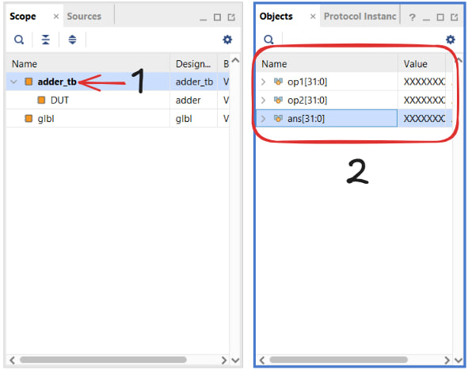

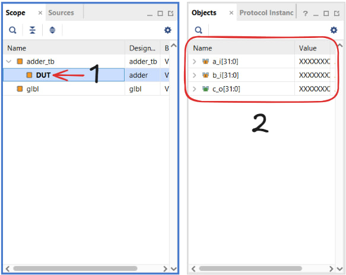

Теперь поговорим о том, как добавляются сигналы на временную диаграмму:

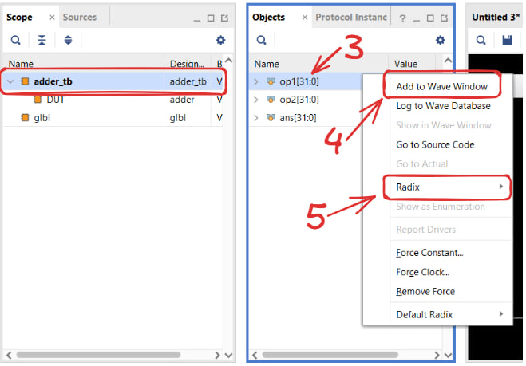

Из скриншота нужно усвоить следующее:
* В **Scope** выбирается модуль, сигналы которого необходимо добавить на временную диаграмму.
* В **Objects** по нужному сигналу кликаем правой кнопкой мыши и выбираем **Add to Wave Window**.
* Если требуется изменить систему счисления для сигнала, то выбираем в **Radix** ту, которая нужна. Тогда в поле **Value**
значение сигнала будет отображаться в той системе, которая была выбрана, **НО** на временной диаграмме еще нет. О том, как
установить нужную систему счисления на временной диаграмме, будет рассказано ниже.

После этого на **Waveform (временной диаграмме)** появятся сигналы, которые вы добавили, а также будут отображаться значения входов и выходов тестируемого модуля:

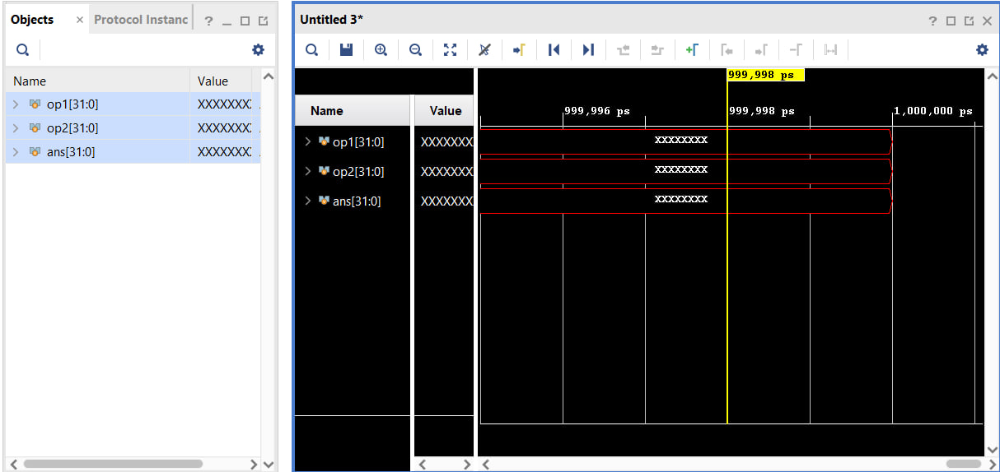

Обратим внимание на следующее:
* Если требуется изменить систему счисления, то также правой кнопкой кликаем по сигналу и в **Radix** меняем ее.
* Т.к. пока не было подано никаких входных воздействий на спроектированное устройство, входы и выходы находятся
в **неизвестном состоянии X**.

На предыдущем скриншоте на временную диаграмму были добавлены сигналы из модуля **adder_tb**, вам ничего не мешает сделать то же самое и для тестируемого модуля **DUT**:

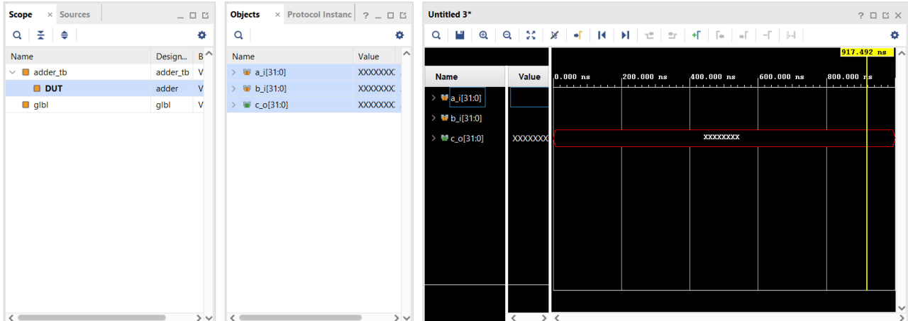

Далее будет затронута тема того, как же подать входные воздействия на устройство и как определять правильность работы тестируемого модуля по временной диаграмме.

## Initial блок
В языке **SystemVerilog** для управления потоком выполнения внутри модулей используются процедурные блоки. Один из таких процедурных блоков известен как **initial** блок.
Блок **initial**, как следует из названия, выполняется один раз в начале моделирования, и операторы внутри него выполняются последовательно.
Для объединения нескольких операторов внутри блока **initial** используются ключевые слова **begin** и **end**.
### Тестирование комбинационной логики
Пусть нам требуется проверить работоспособность модуля, который просто выполняет сложение двух чисел и на выход подает их сумму:
```verilog
module adder(
  input  logic[31:0] a_i,
  input  logic[31:0] b_i,

  output logic[31:0] c_o
);

  assign c_o = a_i + b_i;

endmodule
```
Вспомним о том, как выглядит код модуля adder_tb:
```verilog
module adder_tb();

logic[31:0] op1;
logic[31:0] op2;

logic[31:0] ans;

adder DUT(
  .a_i ( op1 ),
  .b_i ( op2 ),
  .c_o ( ans )
);
```
В коде выше видно только объявление сигналов, но при этом никаких значений им не присвоено. **initial** блок как раз может с этим помочь.
```verilog
module adder_tb();

logic[31:0] op1;
logic[31:0] op2;

logic[31:0] ans;

initial op1 = 'd15;
initial op2 = 'd16;

adder DUT(
  .a_i ( op1 ),
  .b_i ( op2 ),
  .c_o ( ans )
);
```
С помощью **initial** блока сигналам **op1** и **op2** присвоены значения 15 и 16, которые будут поданы на входы **a_i** и **b_i** тестируемого модуля.

В результате, после запуска симуляции, на временной диаграмме будет следующее:

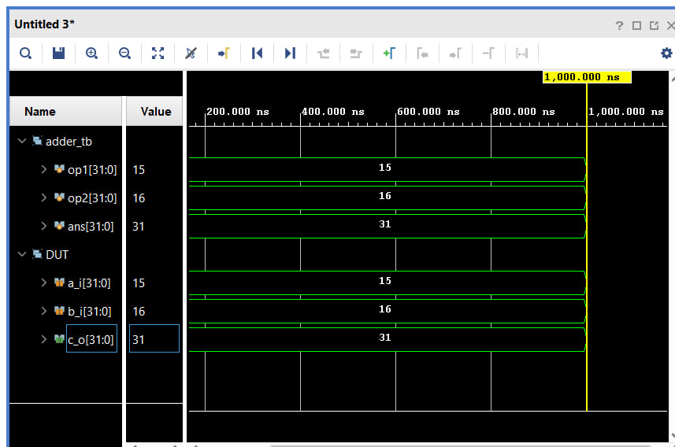

Уточним несколько моментом:
* На временную диаграмму добавлены сигналы из **adder_tb** и **DUT т.е. adder**. И, как можно заметить, сигналы один в один повторяют друг друга.
* Для удобства формат вывода результата на временной диаграмме с помощью **Radix** изменен на десятичный.
* С помощью **New Group** сигналы собраны в две группы. В одной группе сигналы из **adder_tb**, в другой из **DUT**.

А что будет, если в тестбенче не привязывать никакой сигнал к выходу **c_o** тестируемого модуля?
```verilog
module adder_tb();

logic[31:0] op1;
logic[31:0] op2;

logic[31:0] ans;

initial op1 = 'd15;
initial op2 = 'd16;

adder DUT(
  .a_i ( op1 ),
  .b_i ( op2 )
);
```

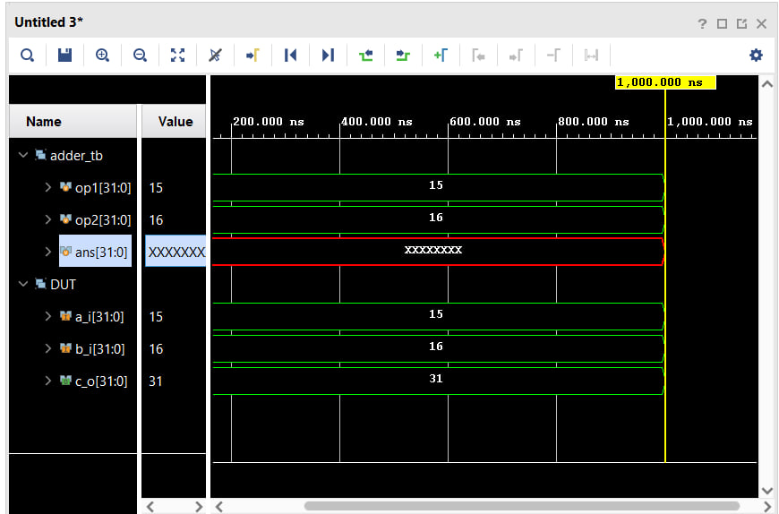

Как видите, сигнал **ans** принял **неизвестное состояние X**, но при этом сам сигнал **c_o** из тестируемого модуля принял правильное значение.
Из этого следует вывод, что в тестбенче необязательно привязывать выходные сигналы тестируемого модуля. Поведение выходов можно отследить подавая только входные воздействия.

Входные воздействия с помощью **initial** блока можно подавать несколько раз в течении одной симуляции:
```verilog
module adder_tb();

logic [31:0] op1;
logic [31:0] op2;
logic [31:0] ans;

initial begin
  op1 = 'd15;
  op2 = 'd16;
  #100
  op1 = 'd12;
  op2 = 'd8;
  #200
  $finish;
end

adder DUT(
  .a_i ( op1 ),
  .b_i ( op2 ),
  .c_o ( ans )
);

endmodule
```
Что из этого кода следует усвоить:
* Если в **initial** блоке больше одной инициализации, то необходимо его обрамлять конструкцией **begin-end**.
* С помощью #100 было указано, что через 100 нс меняются значения сигналов **op1** и **op2**, #200 указывает на то, что через
200 нс будет выполнена команда **$finish** - она заканчивает симуляцию, если вы хотите просто остановить симуляцию, то используйте
команду **$stop**.
* Таким образом $<число> указывает время в нс, через которое необходимо начать выполнение следующих команд.

В результате запуска симуляции кода выше не временной диаграмме будет следующее:

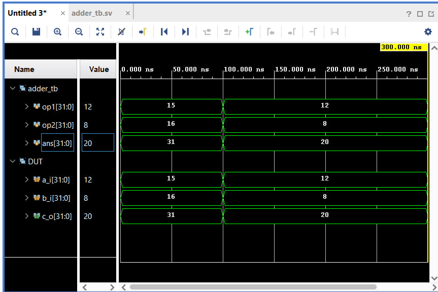

Можно заметить, что через 100 нс на временно диаграмме значения входных сигналов и, соответственно, выходного сигнала - изменились, а через 300нс от начала симуляции - она завершилась.

### Создание тактового сигнала для тестирования последовательстной логики
